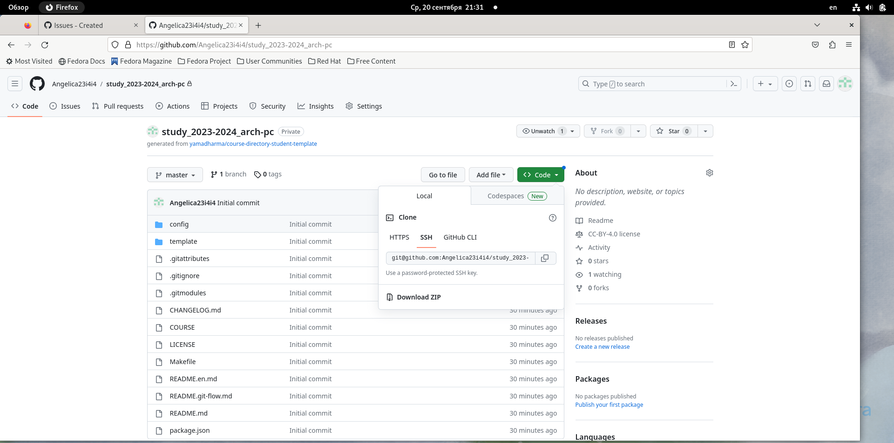

---
## Front matter
title: "Отчет по лабораторной работе №2"
subtitle: "Архитектура компьютера"
author: "Федорова Анжелика Игоревна"

## Generic otions
lang: ru-RU
toc-title: "Содержание"

## Bibliography
bibliography: bib/cite.bib
csl: pandoc/csl/gost-r-7-0-5-2008-numeric.csl

## Pdf output format
toc: true # Table of contents
toc-depth: 2
lof: true # List of figures
lot: true # List of tables
fontsize: 12pt
linestretch: 1.5
papersize: a4
documentclass: scrreprt
## I18n polyglossia
polyglossia-lang:
  name: russian
  options:
	- spelling=modern
	- babelshorthands=true
polyglossia-otherlangs:
  name: english
## I18n babel
babel-lang: russian
babel-otherlangs: english
## Fonts
mainfont: PT Serif
romanfont: PT Serif
sansfont: PT Sans
monofont: PT Mono
mainfontoptions: Ligatures=TeX
romanfontoptions: Ligatures=TeX
sansfontoptions: Ligatures=TeX,Scale=MatchLowercase
monofontoptions: Scale=MatchLowercase,Scale=0.9
## Biblatex
biblatex: true
biblio-style: "gost-numeric"
biblatexoptions:
  - parentracker=true
  - backend=biber
  - hyperref=auto
  - language=auto
  - autolang=other*
  - citestyle=gost-numeric
## Pandoc-crossref LaTeX customization
figureTitle: "Рис."
tableTitle: "Таблица"
listingTitle: "Листинг"
lofTitle: "Список иллюстраций"
lotTitle: "Список таблиц"
lolTitle: "Листинги"
## Misc options
indent: true
header-includes:
  - \usepackage{indentfirst}
  - \usepackage{float} # keep figures where there are in the text
  - \floatplacement{figure}{H} # keep figures where there are in the text
---

# Цель работы

Целью работы является изучить идеологию и применение средств контроля версий. Приобрести практические навыки по работе с системой git.

# Задание

1. Создайте отчет по выполнению лабораторной работы в соответствующем
каталоге
рабочего пространства (labs>lab02>report).
2. Скопируйте отчеты по выполнению предыдущих лабораторных работ в
соответствующие каталоги созданного рабочего пространства.
3. Загрузите файлы на github.

# Порядок выполнения лабораторной работы

1. Базовая настройка Github.
Аккаунт на Github у меня уже был заведен, поэтому дополнительная
настройка не требуется
2. Базовая настройка git
Я открываю терминал и ввожу команды, указав свое имя и email.(рис. fig:001).

{#fig:001 width=70%}

Теперь я должна настроить utf-8 в выводе сообщений git и зададим имя
начальной ветки с помощью команды init.defaultBranch. (рис.fig:002)

{#fig:002 width=70%]}

Теперь я введу параметры autocrlf и safecrlf с помощью команды core.(рис. fig:003)

{#fig:003 width=70%}

3. Создание ключа SSH
Для идентификации пользователя необходимо сгенерировать приватный и
открытый ключи. Это можно сделать с помощью ключа -С.(рис. fig:004)

{#fig:004 width=70%}

Как я могу видеть, ключи сохранены в каталоге ~/.ssh/, и теперь я должна
перейти на сайт http://github.org/ под своей учетной записью, чтобы установить
данные ключи в свой профиль. Сначала я сохраню ключ в буфер обмена эти ключи с помощью команды сat. (рис. fig:005)

{#fig:005 width=70%}

Теперь я захожу в настройки профиля, выбрав раздел «SSH and GPG keys» и
вставляю ключи в нужное поле. (рис. fig:006)

{#fig:006 width=70%}

4. Сознание рабочего пространства и репозитория курса на
основе шаблона

Теперь я должна создать собственное рабочее пространство для предмета
«Архитектура компьютера». Это я могу сделать с помощью команды mkdir. Я создам несколько каталогов (рис.#fig:007)

{#fig:007 width=70%}

Далее, используя ссылку из файла с лабораторной работой, я захожу на сервер
Github и нажимаю «use this template», чтобы выбрать шаблон, и потом выбираю
«create a new repository». (рис.#fig:008)

{#fig:008 width=70%}

Теперь я ввожу имя для своего репозитория «study_2023–2024_arh-pc» и создаю
его (рис.fig:009)

{#fig:009 width=70%}

Теперь я скопирую ссылку на мой созданный репозиторий (рис. fig:010) и
клонирую его (рис.fig:011)

{#fig:010 width=70%}

{#fig:011 width=70%}

5. Настройка каталога курса
Теперь я должна перейти в каталог курса и удалить лишние файлы с помощью
команды rm. (рис.fig:012)

{#fig:012 width=70%}

Далее я создам необходимые каталоги с помощью команд make и
echo(рис.fig:013) и отправлю их на сервер (рис.fig:014)

{#fig:013 width=70%}

{#fig:014 width=70%}

Теперь я могу увидеть, что в моей ветке появились нужные репозитории (рис.fig:015)

{#fig:015 width=70%}

#4 Задания для самостоятельной работы

Задание 1
Сначала я зайду в файловый менеджер и выберу файл с отчетом по
второй лабораторной работе, нажимая на него правой кнопкой мыши и
выбираю «переместить в…» (рис.fig:016)

{#fig:014 width=70%}

Теперь заходим в домашнюю директорию и выбираем подкаталог work (рис.fig:017)

{#fig:017 width=70%}

Проходим полный путь до каталога labs и заходим в каталог lab02 (рис.fig:018)

{#fig:018 width=70%}

После того как я зашла в каталог lab02, мне нужно выбрать подкаталог report и
зайти в него (рис.fig:019)

{#fig:019 width=70%}

Далее я просто должна нажать на кнопку «выбрать» и файл автоматически
переместится в выбранный мною каталог. (рис.fig:020)

{#fig:020 width=70%}

Теперь я могу видеть, что отчет по второй лабораторной работе благополучно
переместился в нужный каталог (рис.fig:021)

{#fig:021 width=70%}

Задание 2
Похожим путем я скопирую отчет о первой лабораторной работе в
соответствующий каталог. Сначала я также найду в загрузках отчет по первой
лабораторной, нажму на него правой кнопкой мыши и выберу «копировать в…»
(рис.fig:022), а затем – пройду тот же сам путь через каталог work к каталогу labs
и выберу подкаталог lab01. (рис.fig:023)

{#fig:022 width=70%}

{#fig:023 width=70%}

Теперь я должна, зайдя в lab01, снова зайти в подкаталог report и нажать
кнопку «выбрать», тем самым подтвердив перемещение файла. (рис.fig:024)

{#fig:024 width=70%}

Также я могу проверить, совершилось ли копирование файла, зайдя в каталог
labs/lab01/report и убедиться, что операция выполнена успешно (рис.fig:025)

{#fig:025 width=70%}

Задание 3
Теперь я загружу все соответствующие изменения в моем репозитории через
консоль. Для этого сначала я переду в каталог ~/work/study/2023-
2024/Архитектура компьютера/arch-pc с помощью команды cd и добавлю все
файлы в локальный репозиторий с помощью команды «git add .» (рис.fig:026)

{#fig:026 width=70%}

Теперь я дам комментарий, какие именно изменения были сделаны, а именно –
«create lab report» (перевод: создание отчета по лабораторной работе) с
помощью команды git commit –am (рис.fig:027)

{#fig:027 width=70%}

Последней операцией будет команда git push, которая полностью подтвердит
внесенные изменения и добавит перемещенные по каталогам файлы в
соответствующие каталоги в моем репозитории на сайте github.com. Также я
использую ключ –f (рис.fig:028), чтобы вновь синхронизироваться с удаленным
репозиторием и избежать ошибки при запросе из-за переписанных
комментарий, которые Git больше не распознает из-за внесенных изменений во
внешнем репозитории.

{#fig:028 width=70%}

Теперь я могу проверить выполнение команды, зайдя в свой аккаунт на
github.com. Как я могу видеть, все изменения были успешно
загружены.(рис.fig:029 и рис.fig:030)

{#fig:029 width=70%}

{#fig:030 width=70%}

# Выводы

Я приобрела практические навыки по работе с системой git, а также изучила
идеологию и применение средств контроля версий.

# Список литературы

[https://frontend-stuff.com/blog/git-force/](«Как обновить удаленный репозиторий после выполнения git rebase»[Статья])
[/home/aifyodorova/Загрузки/Лабораторная_работа_№2_Система_контроля_версий_Git.pdf](Лабораторная_работа_№2_Система_контроля_версий_Git.pdf)
