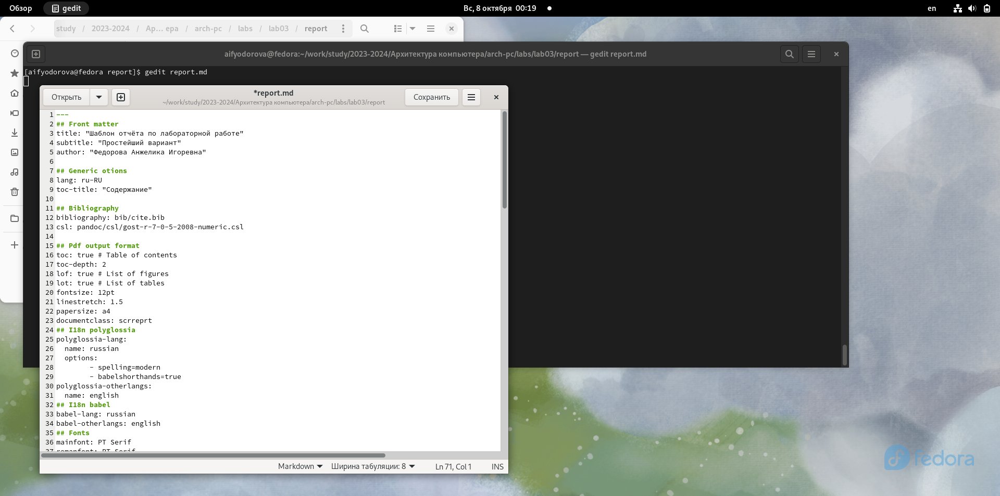

---
## Front matter
title: "Отчет по лабораторной работе №3"
subtitle: "Дисциплина: Архитектура компьютера"
author: "Федорова Анжелика Игоревна"

## Generic otions
lang: ru-RU
toc-title: "Содержание"

## Bibliography
bibliography: bib/cite.bib
csl: pandoc/csl/gost-r-7-0-5-2008-numeric.csl

## Pdf output format
toc: true # Table of contents
toc-depth: 2
lof: true # List of figures
lot: true # List of tables
fontsize: 12pt
linestretch: 1.5
papersize: a4
documentclass: scrreprt
## I18n polyglossia
polyglossia-lang:
  name: russian
  options:
	- spelling=modern
	- babelshorthands=true
polyglossia-otherlangs:
  name: english
## I18n babel
babel-lang: russian
babel-otherlangs: english
## Fonts
mainfont: PT Serif
romanfont: PT Serif
sansfont: PT Sans
monofont: PT Mono
mainfontoptions: Ligatures=TeX
romanfontoptions: Ligatures=TeX
sansfontoptions: Ligatures=TeX,Scale=MatchLowercase
monofontoptions: Scale=MatchLowercase,Scale=0.9
## Biblatex
biblatex: true
biblio-style: "gost-numeric"
biblatexoptions:
  - parentracker=true
  - backend=biber
  - hyperref=auto
  - language=auto
  - autolang=other*
  - citestyle=gost-numeric
## Pandoc-crossref LaTeX customization
figureTitle: "Рис."
tableTitle: "Таблица"
listingTitle: "Листинг"
lofTitle: "Список иллюстраций"
lotTitle: "Список таблиц"
lolTitle: "Листинги"
## Misc options
indent: true
header-includes:
  - \usepackage{indentfirst}
  - \usepackage{float} # keep figures where there are in the text
  - \floatplacement{figure}{H} # keep figures where there are in the text
---

# Цель работы
Целью данной лабораторной работы является освоение процедуры оформления отчетов с помощью легковесного языка разметки Markdown.

# Задание
1. В соответствующем каталоге сделайте отчёт по лабораторной работе № 2 в формате
Markdown. В качестве отчёта необходимо предоставить отчёты в 3 форматах: pdf, docx
и md.
2. Загрузите файлы на github.

# Теоретическое введение
                                         |
Markdown - легковесный язык разметки, созданный с целью обозначения форматирования в простом тексте, с максимальным сохранением его читаемости человеком, и пригодный для машинного преобразования в языки для продвинутых публикаций. Внутритекстовые формулы делаются аналогично формулам LaTeX. В Markdown вставить изображение в документ можно с помощью непосредственного указания адреса изображения. Синтаксис Markdown для встроенной ссылки состоит из части [link text], представляющей текст гиперссылки, и части (file-name.md) – URL-адреса или имени файла, на который дается ссылка. Markdown поддерживает как встраивание фрагментов кода в предложение, так и их размещение между предложениями в виде отдельных огражденных блоков. Огражденные блоки кода — это простой способ выделить синтаксис для фрагментов кода.

# Выполнение лабораторной работы

Сначала я открываю терминал и перехожу в каталог курса, сформированного в ходе выполнения лабораторной работы №2 с помощью команды cd и обновлю локальный репозиторий с помощью команды git pull, скачав изменения из удаленного репозитория с помощью команды (рис.fig:001).

{#fig:001 width=70%}

Теперь я зайду в каталог каталог с шаблоном отчета по лабораторной работе № 3 (рис. fig:002)

.png "Hey"){#fig:002 width=70%}

Теперь я провожу компиляцию шаблона с использованием Makefile. Для этого я просто должна ввести команду make (рис.fig:003)

{#fig:003 width=70%}

Теперь я проверяю создание файла (рис.fig:004) и как он был скомпилирован, открыв docx и pdf файлы в соответствующих текстовых редакторах. (см.рис.fig:005 и рис.fig:006) 

{#fig:004 width=70%}

{#fig:005 width=70%}

{#fig:006 width=70%}

Теперь я вижу, что файлы были правильно скомпилированы.

Теперь я должна удалить созданные файлы с помощью команды make clean и проверю их удаление с помощью команды ls(см. рис.fig:007)

{#fig:007 width=70%]}

Я вижу, что файлы были успешно удалены.

Теперь я открываю файл report.md в текстовом редакторе gedit. (cм.рис.fig:008)

{#fig:008 width=70%}

Я хочу сохранить на всякий случай шаблон данного отчета, поэтому я скопирую его в каталог tmp c помощью команды cp.(cм.рис.fig:009])
{#fig:008 width=70%}

Теперь я начну заполнять отчет с помощью языка разметки Mark_down в скопированном файле. (см.рис.fig:0010)

{#fig:0010 width=70%}

#Задание для самостоятельной работы

Чтобы заполнить отчет по второй лабораторной работе таким же способом, я перейду в директорию lab02/report с помощью команды cd.(см.рис.fig:011)

{#fig:011 width=70%}

Копирую файл report.md с новым именем для заполнения отчета. (см.рис.fig:012)

{#fig:012 width=70%}

Теперь я открываю скопированный файл с помощью текстового редактора gedit и начинаю заполнять отчет. (см.рис.fig:013)

{#fig:013 width=70%}

Удаляю предыдущий файл отчета, чтобы при компиляции он мне не мешал (см.рис.fig:014)

{#fig:014 width=70%}

Компилирую файл с отчетом по лабораторной работе. (см.рис.fig:015)

{#fig:015 width=70%}

Удаляю ненужные файлы report.docx и report.pdf, скомплированные в результате преобразования файла ЛО3_Федорова_отчет.md.(см.рис.fig:016)

{#fig:016 width=70%}

Добавляю изменения на GitHub с помощью комнадой git add и подтверждаю изменения с помощью commit (см.рис fig:017).

{#fig:017 width=70%}

Теперь я должна просто выгрузить все изменения в локальный репозиторий с помощью команды git push. (см.рис fig:018).

{#fig:018 width=70%}

Я могу удостовериться, что все изменения отображаются в репозитории на Github.com. (см.рис fig:019).

{#fig:019 width=70%}

# Выводы

В результате выполнения данной лабораторной работы я освоила процедуры оформления отчетов с помощью легковесного языка разметки Markdown

# Список литературы

[Лабораторная_работа_№3_Язык_разметки.pdf](/home/aifyodorova/Загрузки/Лабораторная_работа_№3_Язык_разметки.pdf)
