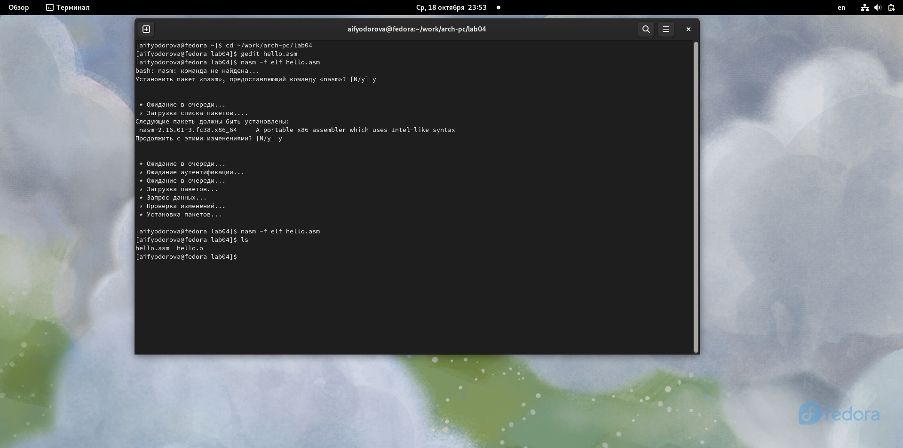
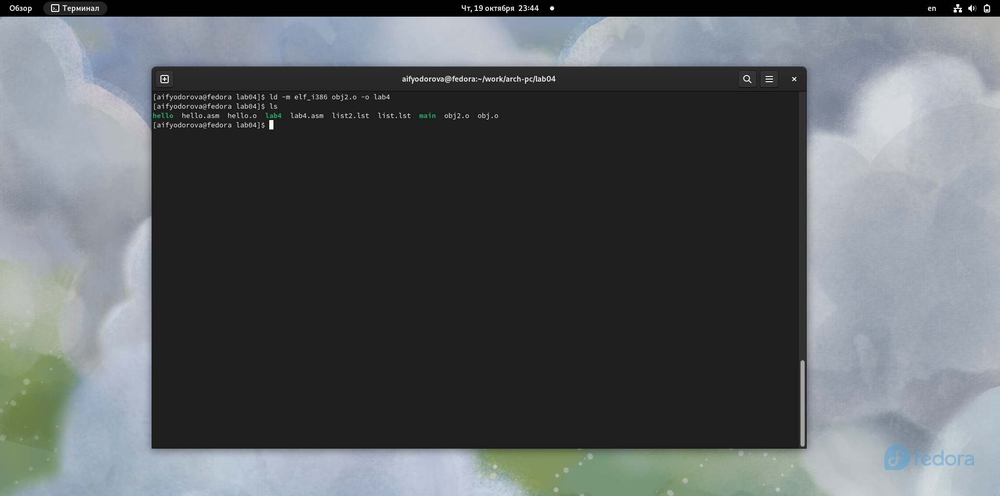
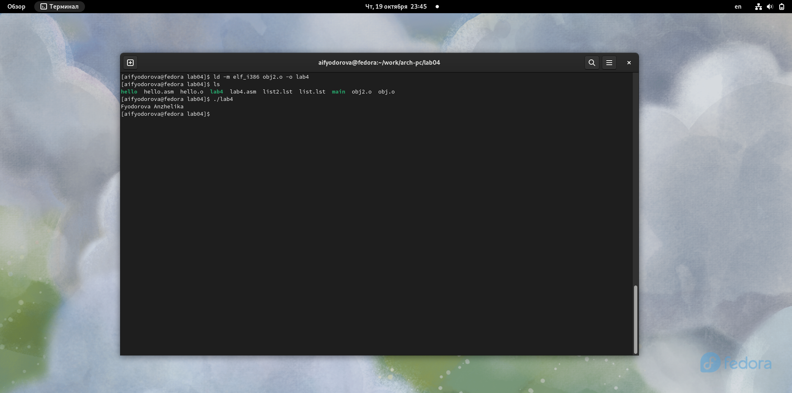

---
## Front matter
title: "Отчет по лабораторной работе №4"
subtitle: "Дисциплина: архитектура компьютера"
author: "Федорова Анжелика Игоревна"

## Generic otions
lang: ru-RU
toc-title: "Содержание"

## Bibliography
bibliography: bib/cite.bib
csl: pandoc/csl/gost-r-7-0-5-2008-numeric.csl

## Pdf output format
toc: true # Table of contents
toc-depth: 2
lof: true # List of figures
lot: true # List of tables
fontsize: 12pt
linestretch: 1.5
papersize: a4
documentclass: scrreprt
## I18n polyglossia
polyglossia-lang:
  name: russian
  options:
	- spelling=modern
	- babelshorthands=true
polyglossia-otherlangs:
  name: english
## I18n babel
babel-lang: russian
babel-otherlangs: english
## Fonts
mainfont: PT Serif
romanfont: PT Serif
sansfont: PT Sans
monofont: PT Mono
mainfontoptions: Ligatures=TeX
romanfontoptions: Ligatures=TeX
sansfontoptions: Ligatures=TeX,Scale=MatchLowercase
monofontoptions: Scale=MatchLowercase,Scale=0.9
## Biblatex
biblatex: true
biblio-style: "gost-numeric"
biblatexoptions:
  - parentracker=true
  - backend=biber
  - hyperref=auto
  - language=auto
  - autolang=other*
  - citestyle=gost-numeric
## Pandoc-crossref LaTeX customization
figureTitle: "Рис."
listingTitle: "Листинг"
lofTitle: "Список иллюстраций"
lolTitle: "Листинги"
## Misc options
indent: true
header-includes:
  - \usepackage{indentfirst}
  - \usepackage{float} # keep figures where there are in the text
  - \floatplacement{figure}{H} # keep figures where there are in the text
---

# Цель работы

Освоение процедуры компиляции и сборки программ, написанных на ассемблере NASM.

# Задание

1. В каталоге ~/work/arch-pc/lab04 с помощью команды cp создайте копию файла
hello.asm с именем lab4.asm
2. С помощью любого текстового редактора внесите изменения в текст программы в
файле lab4.asm так, чтобы вместо Hello world! на экран выводилась строка с вашими
фамилией и именем.
3. Оттранслируйте полученный текст программы lab4.asm в объектный файл. Выполните
компоновку объектного файла и запустите получившийся исполняемый файл.
4. Скопируйте файлы hello.asm и lab4.asm в Ваш локальный репозиторий в ката-
лог
~/work/study/2023-2024/"Архитектура компьютера"/arch-pc/labs/lab04/.
Загрузите файлы на Github.

# Теоретическое введение

Основными функциональными элементами любой ЭВМ являются центральный процессор, память и периферийные устройства. Взаимодействие этих устройств осуществляется через общую шину, к которой они подключены. Физически шина представляет собой большое количество проводников, соединяющих устройства друг с другом. В современных компьютерах проводники выполнены в виде электропроводящих дорожек на материнской плате. Основной задачей процессора является обработка информации, а также организация координации всех узлов компьютера. В состав центрального процессора входят следующие устройства:
арифметико-логическое устройство (АЛУ) — выполняет логические и арифметические действия, необходимые для обработки информации, хранящейся в памяти; устройство управления (УУ) — обеспечивает управление и контроль всех устройств компьютера;
    регистры — сверхбыстрая оперативная память небольшого объёма, входящая в состав процессора, для временного хранения промежуточных результатов выполнения инструкций; регистры процессора делятся на два типа: регистры общего назначения и специальные регистры. Для того, чтобы писать программы на ассемблере, необходимо знать, какие регистры процессора существуют и как их можно использовать. Большинство команд в программах написанных на ассемблере используют регистры в каче- стве операндов. Практически все команды представляют собой преобразование данных хранящихся в регистрах процессора, это например пересылка данных между регистрами или между регистрами и памятью, преобразование (арифметические или логические операции) данных хранящихся в регистрах. Доступ к регистрам осуществляется не по адресам, как к основной памяти, а по именам. Каждый регистр процессора архитектуры x86 имеет свое название, состоящее из 2 или 3 букв латинского алфавита. В качестве примера приведем названия основных регистров общего назначения (именно эти регистры чаще всего используются при написании программ):
RAX, RCX, RDX, RBX, RSI, RDI — 64-битные
EAX, ECX, EDX, EBX, ESI, EDI — 32-битные
AX, CX, DX, BX, SI, DI — 16-битные
AH, AL, CH, CL, DH, DL, BH, BL — 8-битные

Другим важным узлом ЭВМ является оперативное запоминающее устройство (ОЗУ). ОЗУ — это быстродействующее энергозависимое запоминающее устройство, которое напрямую взаимодействует с узлами процессора, предназначенное для хранения программ и данных, с которыми процессор непосредственно работает в текущий момент. ОЗУ состоит из одинаковых пронумерованных ячеек памяти. Номер ячейки памяти — это адрес хранящихся в ней данных. Периферийные устройства в составе ЭВМ:

устройства внешней памяти, которые предназначены для долговременного хранения больших объёмов данных.
yстройства ввода-вывода, которые обеспечивают взаимодействие ЦП с внешней средой.

В основе вычислительного процесса ЭВМ лежит принцип программного управления. Это означает, что компьютер решает поставленную задачу как последовательность действий, записанных в виде программы.

Коды команд представляют собой многоразрядные двоичные комбинации из 0 и 1. В коде машинной команды можно выделить две части: операционную и адресную. В операционной части хранится код команды, которую необходимо выполнить. В адресной части хранятся данные или адреса данных, которые участвуют в выполнении данной операции. При выполнении каждой команды процессор выполняет определённую последовательность стандартных действий, которая называется командным циклом процессора. Он заключается в следующем:

формирование адреса в памяти очередной команды;
считывание кода команды из памяти и её дешифрация;
выполнение команды;
переход к следующей команде.

Язык ассемблера (assembly language, сокращённо asm) — машинно-ориентированный язык низкого уровня. NASM — это открытый проект ассемблера, версии которого доступны под различные операционные системы и который позволяет получать объектные файлы для этих систем. В NASM используется Intel-синтаксис и поддерживаются инструкции x86-64.

# Выполнение лабораторной работы

  Я создаю директорию ~/work/arch-pc/lab04 с помощью команды mkdir и захожу в нее(см.рис1)
  
{#fig:001 width=70%}

Затем  я создаю файл с именем hello.asm с помощью команды touch  и открываю этот файл с помощью gedit. (cм.рис.2)

{#fig:002 width=70%}

Далее я ввожу в созданный код, указанный в файле по лабораторной работе.(cм.рис.3)

{#fig:003 width=70%}

NASM превращает текст программы в объектный код. Чтобы скомпилировать программу данного  текста для вывода надписи «Hello World», я напишу  команду nasm с ключом -f (см.рис.4)

{#fig:004 width=70%}

Команда nasm должна была скомпилировать из файла hello.asm файл с именем hello.o (см.рис.5). Я проверю это  с помощью команды ls(cм.рис.6)

{#fig:005 width=70%}

{#fig:006 width=70%}

Для того, чтобы исполнить задуманную программу необходимо передать файл компоновщику ld с помощью следующих команд: (см.рис.7)

{#fig:007 width=70%}

С помощью команды ls я проверяю создание файла hello. (cм.рис.8)

{#fig:008 width=70%}

Далее я обрабатываю файл с помощью следующей команды(см.рис.9)

{#fig:009 width=70%}

Теперь проверим какое имя будет иметь созданный файл(см.рис.10)

{#fig:010 width=70%}

Сейчас я запущу созданный мною файл hello через команду ./hello (cм.рис.11) 

{#fig:011 width=70%}

#Самостоятельная работа

С помощью команды  cp создаю файл lab4.asm и копирую в него содержание hello.asm. Проверю также выполнение команды с помощью ls (cм.рис.12)

{#fig:012 width=70%}

Изменю текст файла так, чтобы выводилась мое имя и фамилия. (см.рис.13)

{#fig:013 width=70%}

Теперь я оттранслирую файл lab4.asm в  объектный файл obj2.o с помощью команды nasm (см.рис.14)

{#fig:014 width=70%}

Далее мне необходимо отдать на обработку пакету ld созданный объектный файл и проверяю создание файла lab4(см.рис.15)

{#fig:015 width=70%}

Теперь я запускаю созданный файл lab4 (см.рис.16)

{#fig:016 width=70%}

Далее я копирую файлы lab4.asm и hello.asm в каталог ~/work/study/2023-2024/"Архитектура компьютера"/arch-pc/labs/lab04/  с помощью команды сp (см.рис.17)

{#fig:017 width=70%}

Теперь я отправляю внесенные изменения в локальный резозиторий с помощью команд git add ., git commit, git push (см.рис.18)

{#fig:018 width=70%}

Теперь я захожу в свой репозиторий и проверяю изменения, внесенный с помощью консоли. (см.рис.19)

{#fig:019 width=70%}

# Выводы

Я освоила процедуры компиляции и сборки программ, написанных на ассемблере NASM и создала файл, выводящий мое имя и фамилию.

# Список литературы

[Лабораторная работа №4. Создание и процесс обработки программ на языке ассемблера NASM.pdf](https://esystem.rudn.ru/pluginfile.php/2089084/mod_resource/content/0/%D0%9B%D0%B0%D0%B1%D0%BE%D1%80%D0%B0%D1%82%D0%BE%D1%80%D0%BD%D0%B0%D1%8F%20%D1%80%D0%B0%D0%B1%D0%BE%D1%82%D0%B0%20%E2%84%964.%20%D0%A1%D0%BE%D0%B7%D0%B4%D0%B0%D0%BD%D0%B8%D0%B5%20%D0%B8%20%D0%BF%D1%80%D0%BE%D1%86%D0%B5%D1%81%D1%81%20%D0%BE%D0%B1%D1%80%D0%B0%D0%B1%D0%BE%D1%82%D0%BA%D0%B8%20%D0%BF%D1%80%D0%BE%D0%B3%D1%80%D0%B0%D0%BC%D0%BC%20%D0%BD%D0%B0%20%D1%8F%D0%B7%D1%8B%D0%BA%D0%B5%20%D0%B0%D1%81%D1%81%D0%B5%D0%BC%D0%B1%D0%BB%D0%B5%D1%80%D0%B0%20NASM.pdf)

:::
