---
## Front matter
title: "Отчет по лабораторной работе №5"
subtitle: "Дисциплина: архитектура компьютера"
author: "Федорова Анжелика Игоревна"

## Generic otions
lang: ru-RU
toc-title: "Содержание"

## Bibliography
bibliography: bib/cite.bib
csl: pandoc/csl/gost-r-7-0-5-2008-numeric.csl

## Pdf output format
toc: true # Table of contents
toc-depth: 2
lof: true # List of figures
lot: true # List of tables
fontsize: 12pt
linestretch: 1.5
papersize: a4
documentclass: scrreprt
## I18n polyglossia
polyglossia-lang:
  name: russian
  options:
	- spelling=modern
	- babelshorthands=true
polyglossia-otherlangs:
  name: english
## I18n babel
babel-lang: russian
babel-otherlangs: english
## Fonts
mainfont: PT Serif
romanfont: PT Serif
sansfont: PT Sans
monofont: PT Mono
mainfontoptions: Ligatures=TeX
romanfontoptions: Ligatures=TeX
sansfontoptions: Ligatures=TeX,Scale=MatchLowercase
monofontoptions: Scale=MatchLowercase,Scale=0.9
## Biblatex
biblatex: true
biblio-style: "gost-numeric"
biblatexoptions:
  - parentracker=true
  - backend=biber
  - hyperref=auto
  - language=auto
  - autolang=other*
  - citestyle=gost-numeric
## Pandoc-crossref LaTeX customization
figureTitle: "Рис."
tableTitle: "Таблица"
listingTitle: "Листинг"
lofTitle: "Список иллюстраций"
lotTitle: "Список таблиц"
lolTitle: "Листинги"
## Misc options
indent: true
header-includes:
  - \usepackage{indentfirst}
  - \usepackage{float} # keep figures where there are in the text
  - \floatplacement{figure}{H} # keep figures where there are in the text
---

# Цель работы

Приобретение практических навыков работы в Midnight Commander. Освоение инструкций
языка ассемблера mov и int.

# Задание

1. Создайте копию файла lab5-1.asm. Внесите изменения в программу (без использова-
ния внешнего файла in_out.asm), так чтобы она работала по следующему алгоритму:
• вывести приглашение типа “Введите строку:”;
• ввести строку с клавиатуры;
• вывести введённую строку на экран.
2. Получите исполняемый файл и проверьте его работу. На приглашение ввести строку
введите свою фамилию.
3. Создайте копию файла lab5-2.asm. Исправьте текст программы с использование под-
программ из внешнего файла in_out.asm, так чтобы она работала по следующему
алгоритму:
• вывести приглашение типа “Введите строку:”;
• ввести строку с клавиатуры;
• вывести введённую строку на экран.
4. Создайте исполняемый файл и проверьте его работу.

# Теоретическое введение

Midnight Commander (или просто mc) — это программа, которая позволяет просматривать
структуру каталогов и выполнять основные операции по управлению файловой системой,
т.е. mc является файловым менеджером. Midnight Commander позволяет сделать работу с 
файлами более удобной и наглядной.

# Выполнение лабораторной работы

Открываю Midnight commander(рис.fig:001) и перехожу в каталог arch-pc, который создала в прошлой лабораторной с помощью файлового менеджера mc(рис.fig:002)

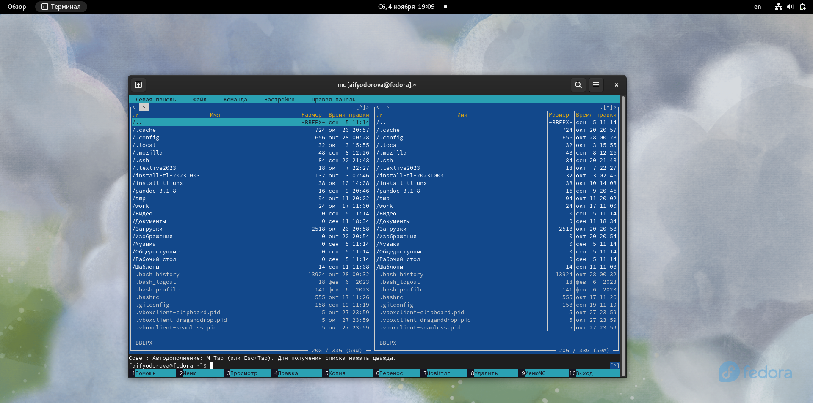{#fig:001 width=70%}

{#fig:002 width=70%}

С помощью клавиши F7 я создаю каталог lab05 (рис.fig:003)

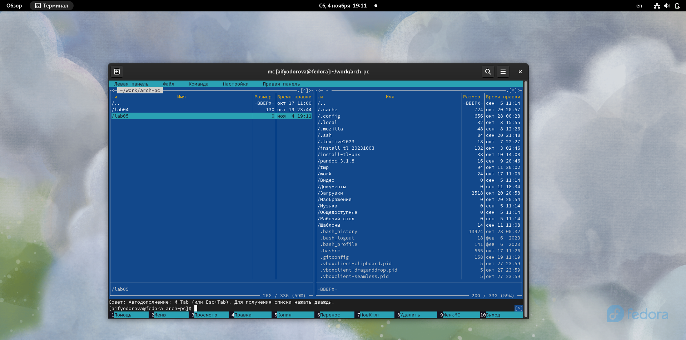{#fig:003 width=70%}

В строке ввода прописываю команду touch lab5-1.asm, чтобы создать файл, в котором буду работать (рис. fig:004).
И проверяю выполнение данного действия (рис. fig:005)

{#fig:004 width=70%}

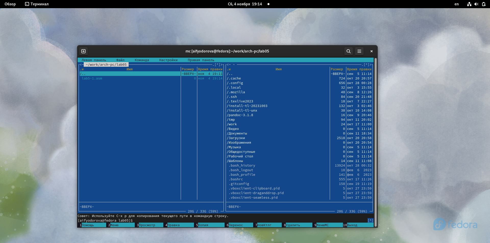{#fig:005 width=70%}

С помощью клавиши F4 открываю файл lab5-1.asm и вставляю в него текст программы из файла (рис. fig:006). 

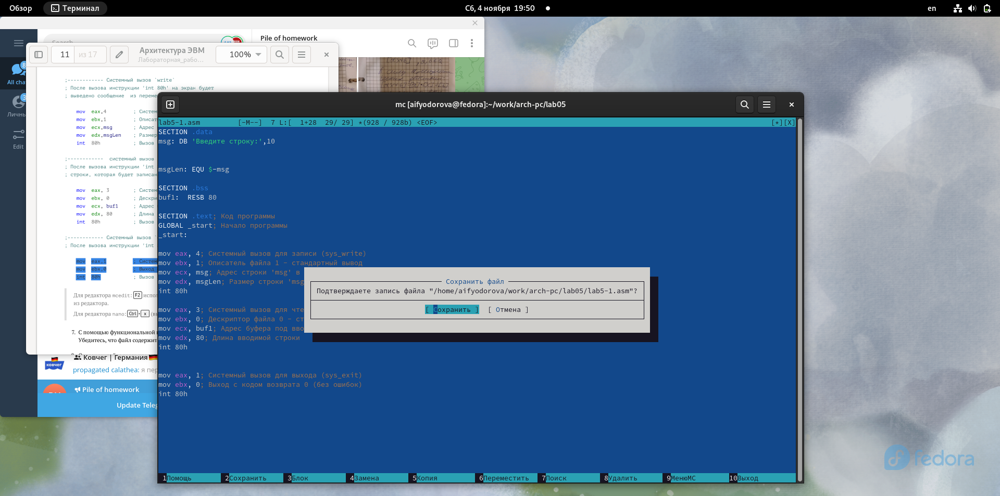{#fig:006 width=70%}

C помощью клавиши F3 я открою файл lab5-1.asm  для просмотра, чтобы убедиться в сохранении всех изменений. (рис. fig:007). Вижу, что все сохранено успешно.

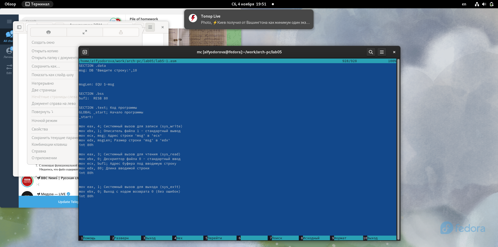{#fig:007 width=70%}

Теперь я оттранслирую исходный файл в объектный файл. (рис. fig:008)

{#fig:008 width=70%}

Теперь запущу созданный файл. (рис. fig:009)

{#fig:009 width=70%}

В результате я вижу, что программа запрашивает у пользователя строку на ввод.

Теперь я изменю программу, подключив к ней внешний файл из  ТУИС.

Помещу файл  в тот же каталог arch-pc, что и lab5-1.asm. (рис. fig:010)

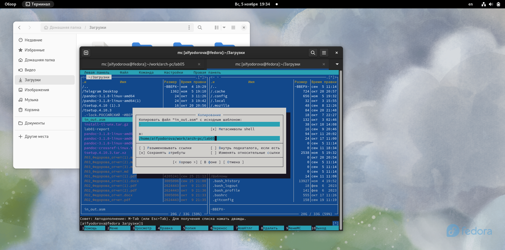{#fig:010 width=70%}

C помощью клавиши F6 копирую файл lab5-1 в файл lab5-2.asm. (рис. fig:011)

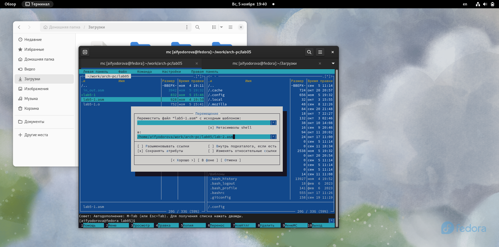{#fig:011 width=70%} 

Открываю файл с помощью клавиши F4 и редактирую код программы, заменяя подпрограмму sprintLF на sprint.(рис. fig:012)

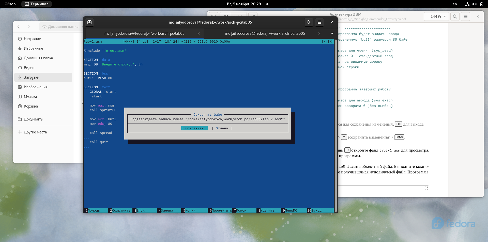{#fig:012 width=70%} 

Теперь я снова создаю исполняемый файл с помощью трансляции в объектный файл.(рис. fig:013)

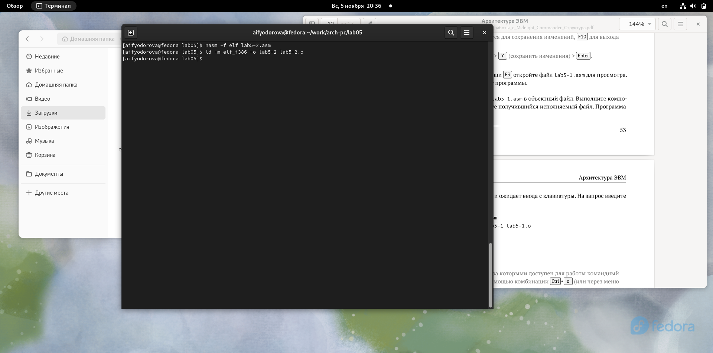{#fig:013 width=70%} 

Теперь запускаю созданный файл lab5-2 ((рис. fig:014)

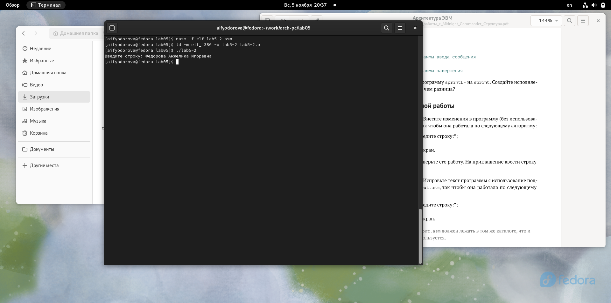{#fig:014 width=70%} 

Разница между предыдущей программой в том, что данная программа просит ввести символы на ввод на той же самой строке без перехода на новую.

#Задания для самостоятельной работы

1. Создаю копию файла lab5-1.asm с именем lab6-1-1.asm с помощью функциональной клавиши F5 (рис.fig:015).

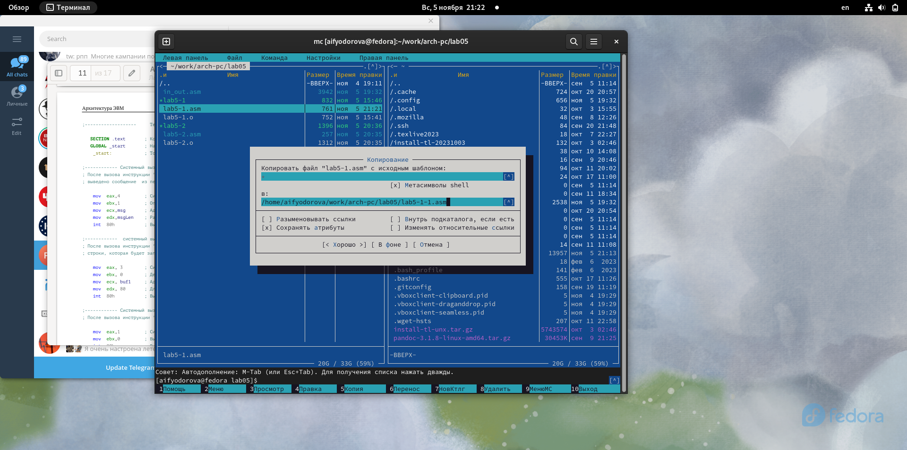{#fig:015 width=70%} 

Теперь я меняю код программы так, чтобы после ввода пользователем какого-либо кол-ва символов программа выводила эти символы. (рис.fig:016)

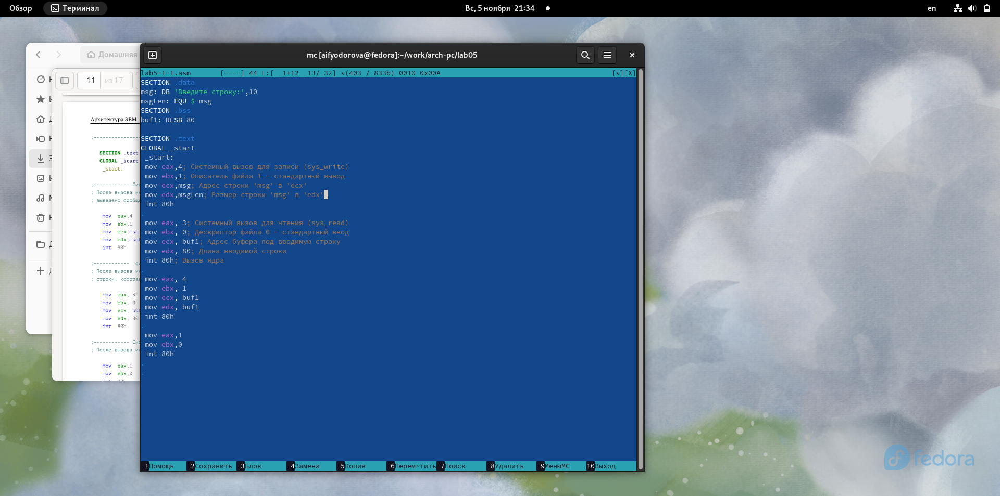{#fig:016 width=70%} 

2. Далее я транслирую файл lab5-1-1.asm в объектный файл для запуска программы (рис.fig:017)

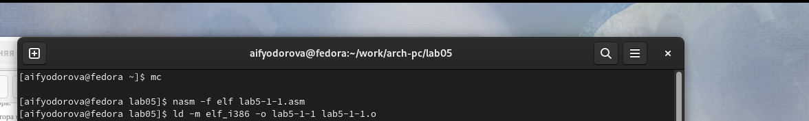{#fig:017 width=70%} 

Теперь я запущу созданный файл (рис.fig:018)

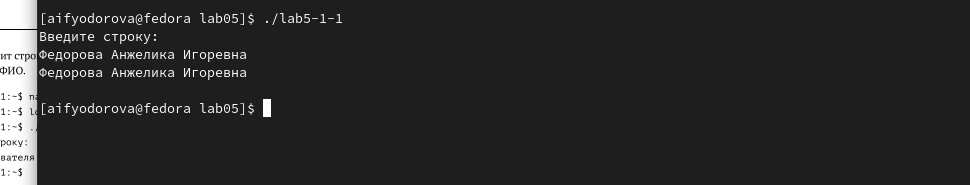{#fig:018 width=70%} 

Программа запрашивает ввод, ввожу свои ФИО, а потом программа выводит введенные мною данные.

3. Далее я снова использую файл in-out.asm, чтобы изменить работу данной программы. Сначала я создам файл lab5-2-1.asm с помощью копирования файла lab5-1-1.asm функциональной клавишей F5.(рис.fig:019)

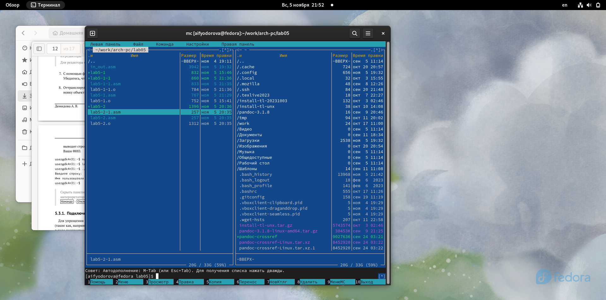{#fig:019 width=70%} 

Далее, нажав клавишу F4 я открываю этот файл и редакторую код, согласно требованиям.(рис.fig:020)

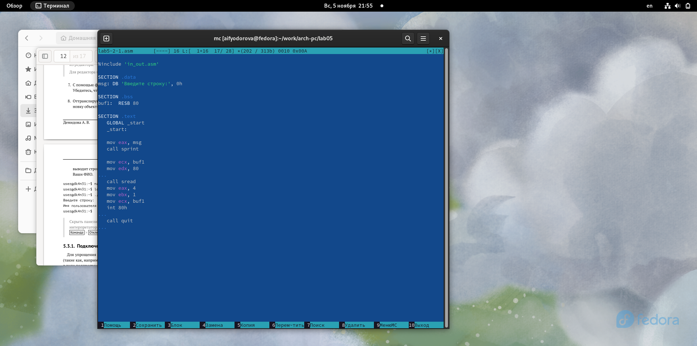{#fig:020 width=70%} 

Теперь я должна получить исполняемый файл с помощью компоновщика ld. (рис.fig:021)

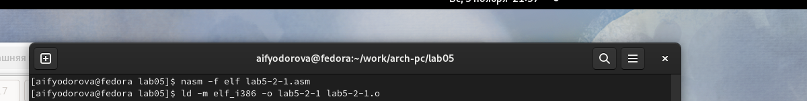{#fig:021 width=70%} 

4. И теперь снова запускаю созданный файл.(рис.fig:022) 

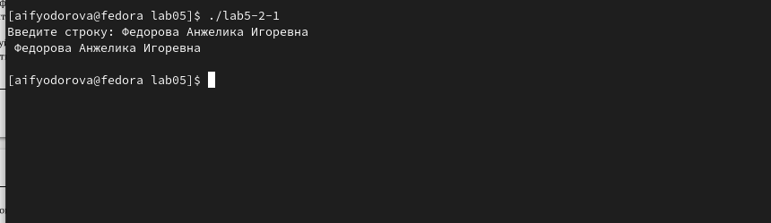{#fig:022 width=70%} 

Программа запрашивает ввод без переноса на новую строку, ввожу свои ФИО, далее программа выводит введенные мною данные.

# Выводы

Я приобрела практические навыкы работы в Midnight Commanderи освоила инструкции
языка ассемблера mov и int.

# Список литературы
[Лабораторная работа №5](https://esystem.rudn.ru/pluginfile.php/2089085/mod_resource/content/0/%D0%9B%D0%B0%D0%B1%D0%BE%D1%80%D0%B0%D1%82%D0%BE%D1%80%D0%BD%D0%B0%D1%8F%20%D1%80%D0%B0%D0%B1%D0%BE%D1%82%D0%B0%20%E2%84%965.%20%D0%9E%D1%81%D0%BD%D0%BE%D0%B2%D1%8B%20%D1%80%D0%B0%D0%B1%D0%BE%D1%82%D1%8B%20%D1%81%20Midnight%20Commander%20%28%29.%20%D0%A1%D1%82%D1%80%D1%83%D0%BA%D1%82%D1%83%D1%80%D0%B0%20%D0%BF%D1%80%D0%BE%D0%B3%D1%80%D0%B0%D0%BC%D0%BC%D1%8B%20%D0%BD%D0%B0%20%D1%8F%D0%B7%D1%8B%D0%BA%D0%B5%20%D0%B0%D1%81%D1%81%D0%B5%D0%BC%D0%B1%D0%BB%D0%B5%D1%80%D0%B0%20NASM.%20%D0%A1%D0%B8%D1%81%D1%82%D0%B5%D0%BC%D0%BD%D1%8B%D0%B5%20%D0%B2%D1%8B%D0%B7%D0%BE%D0%B2%D1%8B%20%D0%B2%20%D0%9E%D0%A1%20GNU%20Linux.pdf)
