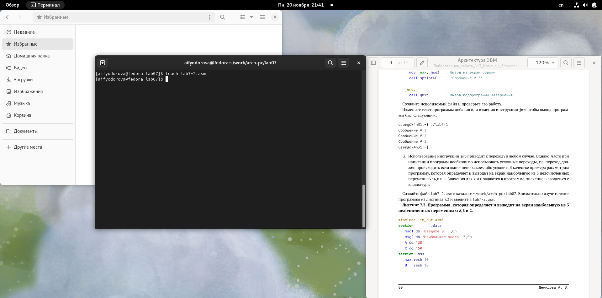
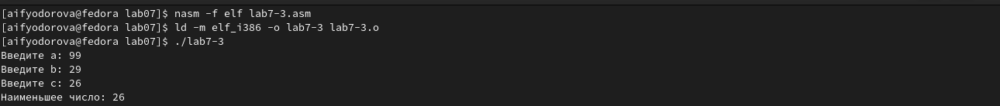

---
## Front matter
title: "Отчет по лабораторной работе №7"
subtitle: "Дисциплина: архитектура компьютера"
author: "Федорова Анжелика Игоревна"

## Generic otions
lang: ru-RU
toc-title: "Содержание"

## Bibliography
bibliography: bib/cite.bib
csl: pandoc/csl/gost-r-7-0-5-2008-numeric.csl

## Pdf output format
toc: true # Table of contents
toc-depth: 2
lof: true # List of figures
lot: true # List of tables
fontsize: 12pt
linestretch: 1.5
papersize: a4
documentclass: scrreprt
## I18n polyglossia
polyglossia-lang:
  name: russian
  options:
	- spelling=modern
	- babelshorthands=true
polyglossia-otherlangs:
  name: english
## I18n babel
babel-lang: russian
babel-otherlangs: english
## Fonts
mainfont: PT Serif
romanfont: PT Serif
sansfont: PT Sans
monofont: PT Mono
mainfontoptions: Ligatures=TeX
romanfontoptions: Ligatures=TeX
sansfontoptions: Ligatures=TeX,Scale=MatchLowercase
monofontoptions: Scale=MatchLowercase,Scale=0.9
## Biblatex
biblatex: true
biblio-style: "gost-numeric"
biblatexoptions:
  - parentracker=true
  - backend=biber
  - hyperref=auto
  - language=auto
  - autolang=other*
  - citestyle=gost-numeric
## Pandoc-crossref LaTeX customization
figureTitle: "Рис."
tableTitle: "Таблица"
listingTitle: "Листинг"
lofTitle: "Список иллюстраций"
lotTitle: "Список таблиц"
lolTitle: "Листинги"
## Misc options
indent: true
header-includes:
  - \usepackage{indentfirst}
  - \usepackage{float} # keep figures where there are in the text
  - \floatplacement{figure}{H} # keep figures where there are in the text
---

# Цель работы

Изучение команд условного и безусловного переходов. Приобретение навыков написания
программ с использованием переходов. Знакомство с назначением и структурой файла
листинга.

# Задание
1. Напишите программу нахождения наименьшей из 3 целочисленных переменных a, b и .
Значения переменных выбрать из табл. 7.5 в соответствии с вариантом, полученным
при выполнении лабораторной работы №6. Создайте исполняемый файл и проверьте
его работу.
2. Напишите программу, которая для введенных с клавиатуры значений x и a вычисляет
значение заданной функции f(x) и выводит результат вычислений. Вид функции f(x)
выбрать из таблицы 7.6 вариантов заданий в соответствии с вариантом, полученным
при выполнении лабораторной работы №6. Создайте исполняемый файл и проверьте
его работу для значений x и a из 7.6.

# Теоретическое введение

Для реализации ветвлений в ассемблере используются так называемые команды передачи
управления или команды перехода. Можно выделить 2 типа переходов:
• условный переход – выполнение или не выполнение перехода в определенную точку
программы в зависимости от проверки условия.
• безусловный переход – выполнение передачи управления в определенную точку про-
граммы без каких-либо условий.


# Выполнение лабораторной работы

 Создаю подкаталог  lab07 в каталоге arch-pc с помощью команды mkdir, захожу в него и создаю файл lab7-1.asm  с помощью  команды touch(рис.fig:001).

{#fig:001 width=70%}

Также я должна скопировать файл in_out.asm в данную директорию, чтобы в дальнейшем подключить ее. (рис.fig:002).

{#fig:002 width=70%}

Теперь я открываю файл lab7-1.asm и копирую в него содержание листинга из лабораторной работы (рис.fig:003).

{#fig:003 width=70%}

Теперь я создаю исполняемый файл и запускаю его. (рис.fig:004)

{#fig:004 width=70%}

Вижу, что выводятся только тексты "Сообщение 2" и "Сообщение 3" .
Теперь я переделываю код в листинге, согласно второму данному мне листингу 7.2 в лабораторной работе. Нужно, чтобы сначала выводилось "Сообщение 1", а потом "Сообщение 2". (рис.fig:005)

{#fig:005 width=70%}

Снова создаю объектный файл и запускаю его. (рис.fig:006)

{#fig:006 width=70%}

Вижу, что теперь текст выводится иначе.
Теперь нужно, чтобы сначала выводилось "Сообщение №3", а затем последовательно по убыванию номера остальные. 
Для этого надо расположить функции jmp в опредленной последовательности (рис.fig:007)

{#fig:007 width=70%}

Cоздаю исполняемый файл и запускаю его (рис.fig:008)

{#fig:008 width=70%}

Вижу, что текст вывелся в соответсвии с требованиями.

Теперь я создаю файл lab7-2.asm. (рис.fig:009)

{#fig:009 width=70%}

Я должна заполнить его кодом из листинга 7.3. (рис.fig:010)

{#fig:010 width=70%}

Теперь я снова провожу трансляцию исходного файла в объектный и запускаю, а затем ввожу рандомное число. (рис.fig:011)

{#fig:011 width=70%}

Программа сравнивает введенное пользователем число с "вшитыми" числами 20(в качестве А) и 50(в качестве С).

Теперь я с помощью команды nasm должна получить файл с расширением .lst от файла lab7-2.asm. (рис.fig:012)

{#fig:012 width=70%}

Проверяю наличие файла lab7-2.lst с помощью команды ls (рис.fig:013)

{#fig:013 width=70%}

Открываю данный файл в mc и смотрю на код. (рис.fig:014)

{#fig:014 width=70%}


Строка 25 записывает значение по адресу В в регистр eax 

В строке 32 с помощью операнда cmp сравнивается значение А, записанное в регистр ecx со значением,  записанным по адресу С.

В строке 33 выполняется переход на секцию "check_B" с помощью jg при условии A>C.

Теперь я удалю любую операнду в файле lab7-2.asm и проверю, что произойдет с файлом lab7-2.lst в реузльтате данного действия(рис.fig:015)

{#fig:015 width=70%}

Как вижу, что программа выдает ошибку.


# Выполнение самостоятельной работы

1. Мой вариант в лабораторной работе №6 был 12. Значит, я создаю файл lab7-3.asm для вычисления наименьшего из чисел а=99, b=29, c=26. (рис.fig:016)

{#fig:016 width=70%}

Пишу код программы в соответсвии с заданием в самостоятельной работе. (рис.fig:017)

{#fig:017 width=70%}

Проверяю работы написанной программы, создав объектный файл и вводя данные мне числа в 12-ом варианте. (рис.fig:018)

{#fig:018 width=70%}

Вижу, что программа выводит правильный ответ.

Код программы:


```NASM

%include 'in_out.asm'
section .data
msg1 db 'Введите a: ',0h
msg2 db 'Введите b: ', 0h 
msg3 db 'Введите c: ', 0h
msg4 db "Наименьшее число: ",0h

section .bss
min resb 10
A resb 10
B resb 10
C resb 10

section .text
global _start
_start:
mov eax,msg1
call sprint

mov ecx, A
mov edx,10
call sread

mov eax, A
call atoi
mov [A],eax

mov eax, msg2
call sprint

mov ecx,B
mov edx,10
call sread

mov eax,B
call atoi
mov [B],eax

mov eax, msg3
call sprint

mov ecx, C 
mov edx, 10
call sread

mov eax, C
call atoi 
mov [C], eax

mov ecx,[A]
mov [min],ecx

cmp ecx,[C]; Сравниваем 'A' и 'С'
jl check_B; если 'A<C', то переход на метку 'check_B',
mov ecx,[C]; иначе 'ecx = C'
mov [min], ecx


check_B:
mov ecx,[min]
cmp ecx,[B]
jl fin
mov ecx, [B]; иначе 'ecx = B'
mov [min], ecx

fin:
mov eax, msg4
call sprint
mov eax,[min]
call iprintLF ; Вывод 'max(A,B,C)'
call quit

```


2. Теперь я создаю файл lab7-4.asm для работы со вторым заданием.(рис.fig:019)

{#fig:019 width=70%}

Пишу код для вычисления функции f= a*x при x<5 и f=х-5 при x=>5. (рис.fig:020)

{#fig:020 width=70%}

Теперь я проверяю работу написанной программы, вводя данные мне значения x и a в материале лабораторной работы.(рис.fig:021)

{#fig:021 width=70%}

Вижу, что программа выводит правильный ответ в обоих случаях.

Код программы: 

```NASM

%include 'in_out.asm'
SECTION .data
msg: DB 'Введите значение х: ',0
msg2: DB 'Введите значение а: ',0
msg3: DB 'Результат: ', 0
C dd '5'

SECTION .bss
r: RESB 10
x: RESB 10
A: RESB 10

SECTION .text
GLOBAL _start
_start:
 mov eax, msg ; Вызываем программу печати 
 call sprint ; сообщения "Введите значение х:"
 
 mov ecx, x ; вводим переменную, значение которой вводит пользователь
 mov edx, 10
 call sread ; Считываем переменную x
 
 mov eax, x ; вызов подпрограммы преобразования
 call atoi ; ASCII кода в число, eax=x
 mov [x], eax ; запись числа по адресу [x]
 
 mov eax,msg2
 call sprint
 
 mov ecx, A
 mov edx,10
 call sread
 
 mov eax,A
 call atoi
 mov [A],eax
 
 mov eax, C
 call atoi
 mov [C], eax
  
 mov ecx, [C]
 cmp ecx, [x]
 jg function_1 ; переход на другую операцию в случае, что х<5
 mov eax, [x] ; выполнение операции х-5 в случае, если х=>5
 sub eax, [C]
 mov [r], eax ; запись результата по адресу "r"
 jmp fin ; переход на вывод результата
 
function_1:
 mov eax, [x] ; выполнение операции а*х 
 mov ebx, [A]; 
 mul ebx ; 
 mov [r],eax ; запись результата по адресу "r"

 
 
fin:
 mov eax,msg3 ; Вызов программы печати
 call sprint; сообщения 'Результат: '
 mov eax, [r] ; вызов подпрограммы печати значения
 call iprintLF ; из 'r' (результат вычисления) в виде символов
 call quit; вызов подпрограммы завершения

```

# Выводы

Я изучила команды условного и безусловного переходов и приобрела навыки написания
программ с использованием переходов, а также познакомилась с назначением и структурой файла
листинга.

# Список литературы

[Лабораторная работа №7](https://esystem.rudn.ru/pluginfile.php/2089087/mod_resource/content/0/%D0%9B%D0%B0%D0%B1%D0%BE%D1%80%D0%B0%D1%82%D0%BE%D1%80%D0%BD%D0%B0%D1%8F%20%D1%80%D0%B0%D0%B1%D0%BE%D1%82%D0%B0%20%E2%84%967.%20%D0%9A%D0%BE%D0%BC%D0%B0%D0%BD%D0%B4%D1%8B%20%D0%B1%D0%B5%D0%B7%D1%83%D1%81%D0%BB%D0%BE%D0%B2%D0%BD%D0%BE%D0%B3%D0%BE%20%D0%B8%20%D1%83%D1%81%D0%BB%D0%BE%D0%B2%D0%BD%D0%BE%D0%B3%D0%BE%20%D0%BF%D0%B5%D1%80%D0%B5%D1%85%D0%BE%D0%B4%D0%BE%D0%B2%20%D0%B2%20Nasm.%20%D0%9F%D1%80%D0%BE%D0%B3%D1%80%D0%B0%D0%BC%D0%BC%D0%B8%D1%80%D0%BE%D0%B2%D0%B0%D0%BD%D0%B8%D0%B5%20%D0%B2%D0%B5%D1%82%D0%B2%D0%BB%D0%B5%D0%BD%D0%B8%D0%B9..pdf)
