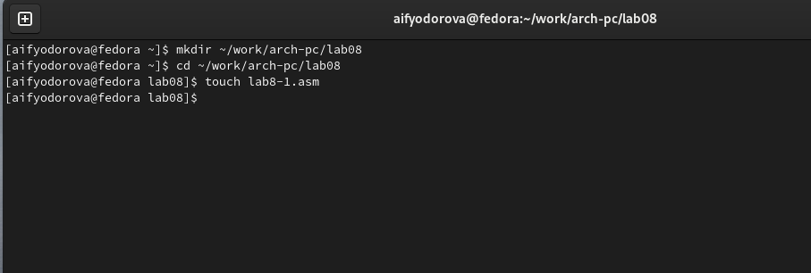
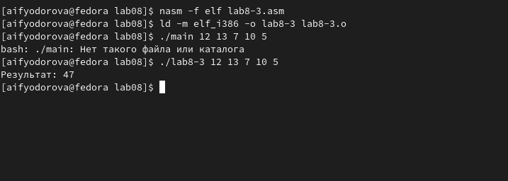

---
## Front matter
title: "Отчет по лабораторной работе №8"
subtitle: "Дисциплина: архитектура компьютера"
author: "Федорова Анжелика Игоревна"

## Generic otions
lang: ru-RU
toc-title: "Содержание"

## Bibliography
bibliography: bib/cite.bib
csl: pandoc/csl/gost-r-7-0-5-2008-numeric.csl

## Pdf output format
toc: true # Table of contents
toc-depth: 2
lof: true # List of figures
lot: true # List of tables
fontsize: 12pt
linestretch: 1.5
papersize: a4
documentclass: scrreprt
## I18n polyglossia
polyglossia-lang:
  name: russian
  options:
	- spelling=modern
	- babelshorthands=true
polyglossia-otherlangs:
  name: english
## I18n babel
babel-lang: russian
babel-otherlangs: english
## Fonts
mainfont: PT Serif
romanfont: PT Serif
sansfont: PT Sans
monofont: PT Mono
mainfontoptions: Ligatures=TeX
romanfontoptions: Ligatures=TeX
sansfontoptions: Ligatures=TeX,Scale=MatchLowercase
monofontoptions: Scale=MatchLowercase,Scale=0.9
## Biblatex
biblatex: true
biblio-style: "gost-numeric"
biblatexoptions:
  - parentracker=true
  - backend=biber
  - hyperref=auto
  - language=auto
  - autolang=other*
  - citestyle=gost-numeric
## Pandoc-crossref LaTeX customization
figureTitle: "Рис."
tableTitle: "Таблица"
listingTitle: "Листинг"
lofTitle: "Список иллюстраций"
lotTitle: "Список таблиц"
lolTitle: "Листинги"
## Misc options
indent: true
header-includes:
  - \usepackage{indentfirst}
  - \usepackage{float} # keep figures where there are in the text
  - \floatplacement{figure}{H} # keep figures where there are in the text
---

# Цель работы

Приобретение навыков написания программ с использованием циклов и обработкой
аргументов командной строки.

# Задание

Напишите программу, которая находит сумму значений функции f(x) для
x = x1 , x2 , ..., xn , т.е. программа должна выводить значение f(x1) + f(x2) + ... + f(xn).
Значения xi передаются как аргументы. Вид функции f(x) выбрать из таблицы
8.1 вариантов заданий в соответствии с вариантом, полученным при выполнении
лабораторной работы № 7. Создайте исполняемый файл и проверьте его работу на
нескольких наборах x = x1 , x2 , ..., xn.

# Теоретическое введение

Стек — это структура данных, организованная по принципу LIFO («Last In — First Out»
или «последним пришёл — первым ушёл»). Стек является частью архитектуры процессора и
реализован на аппаратном уровне. Для работы со стеком в процессоре есть специальные
регистры (ss, bp, sp) и команды.
Основной функцией стека является функция сохранения адресов возврата и передачи
аргументов при вызове процедур. Кроме того, в нём выделяется память для локальных
переменных и могут временно храниться значения регистров.
На рис. 8.1 показана схема организации стека в процессоре.
Стек имеет вершину, адрес последнего добавленного элемента, который хранится в ре-
гистре esp (указатель стека). Противоположный конец стека называется дном. Значение,
помещённое в стек последним, извлекается первым. При помещении значения в стек указа-
тель стека уменьшается, а при извлечении — увеличивается.
Для стека существует две основные операции:
• добавление элемента в вершину стека (push);
• извлечение элемента из вершины стека (pop).


# Выполнение лабораторной работы

Я создаю каталог ~/work/arch-pc/lab08 с помошью команды mkdir и создаю файл lab8-1.asm с помощью touch (рис. fig:001).

{#fig:001 width=70%}

Также я должна скопировать файл in_out.asm в данную директорию, чтобы в
дальнейшем подключить ее. (рис.fig:002)

{#fig:002 width=70%}

Теперь я заполняю  файл lab8-1.asm  кодом из листинга 8.1 (рис. fig:003).

{#fig:003 width=70%}

Я создаю исполняемый файл и запускаю его. (рис. fig:004)

{#fig:004 width=70%}

Вижу, что программа выводит все числа по убыванию от введенного пользователем числа до единицы. Значит, программа совершает именно то количество циклов, соответствующее введенному с клавиатуры числу.

Я должна изменить программу согласно указанию в материале по лабораторной работе, добавив строку "sub ecx,1" в секции label. (рис. fig:005)

{#fig:005 width=70%}

Теперь снова транслирую .asm файл  в объектный файл и запускаю программу.(рис. fig:006)

{#fig:006 width=70%}

В данном случае видно, что регистр ecx принимает  только положительные нечетные значения и на выходе пользователь получает только их. Значит, число всех циклов в программе не соотвествует числу, введенному с клавиатуры.
Теперь я снова редактирую код по имеющимся в материалах указаниям, добавив строку "push ecx" в секции label. (рис. fig:007)

{#fig:006 width=70%}

Снова создаю исполняемый файл и запускаю его.(рис. fig:008)

{#fig:008 width=70%}

Теперь я вижу, что программа выдает числа из отрезка [0, 4], то есть получается ровно 5 чисел, а значит программа производит то число циклов, которое было введено пользователем.

Далее я создаю файл lab8-2.asm.(рис. fig:009)

{#fig:009 width=70%}

Заполняю данный файл кодом из листинга 8.2 (рис. fig:010)

{#fig:009 width=70%}

Теперь оттранслирую исходный файл в объектный и запущу его. (рис. fig:011)

{#fig:010 width=70%}

Введя 3 аргумента согласно схеме в лабораторной работе, я вижу, что программа вывела все введенные мною аргументы. Значит, программа обработала все аргументы.
Теперь я создаю новый файл lab8-3.asm (рис. fig:012)

{#fig:012 width=70%}

Ввожу данный мне код данной мне программы. (рис. fig:013)

{#fig:013 width=70%}

После транслции запускаю программу смотрю на результат. (рис. fig:014)

{#fig:014 width=70%}

Вижу, что программа выводит сумму всех введенных аргументов.
Теперь я меняю код программы, согласно указаниям, чтобы программа перемножала введенные аргументы.(рис. fig:015)

{#fig:015 width=70%}

Теперь запускаю программу, чтобы проверить ее действие. (рис. fig:016)

{#fig:015 width=70%}

Вижу, что программа работает исправно.

Исправленный код: 

```NASM

%include 'in_out.asm'
SECTION .data
msg db "Результат: ",0
SECTION .text
global _start
_start:
pop ecx ; Извлекаем из стека в ecx количество
; аргументов (первое значение в стеке)
pop edx ; Извлекаем из стека в edx имя программы
; (второе значение в стеке)
sub ecx,1 ; Уменьшаем ecx на 1 (количество
; аргументов без названия программы)
mov esi, 1 ; Используем esi для хранения
; промежуточных произведений
next:
cmp ecx,0h ; проверяем, есть ли еще аргументы
jz _end ; если аргументов нет выходим из цикла
        ; (переход на метку _end)
pop eax ; иначе извлекаем следующий аргумент из стекa
call atoi ; преобразуем символ в число 
mov ebx, eax ; перемещаем значение из еax в ebx
mov eax, esi ; перемещаем значение из esi в eax, чтобы результат записался при следующей операции записался в eax.
mul ebx ;eax = eax*ebx
mov esi, eax ; перемещаем обратно в esi
`
loop next ; переход к обработке следующего аргумента
_end:
mov eax , msg ; вывод сообщения "Результат: "
call sprint
mov eax, esi ; записываем сумму в регистр eax
call iprintLF ; печать результата
call quit ; завершение программы

```


# Самостоятельная работа

Создаю файл lab8-4.asm. (рис. fig:017)

{#fig:015 width=70%}

В данной работе мне нужно реализовать функцию под номером 12(согласно моему варианту в прошлой лабораторной работе), то есть f(x) = 15*x-9. Также, если при вводе дано несколько аргументов, программа должна вычислить сумму соответствующих им значений функции.
Я заполняю файл lab8-4.asm. соответсвующим кодом. (рис. fig:018)

{#fig:018 width=70%}

Теперь я создаю исполняемый файл и проверяю работу своего кода. (рис. fig:019)

{#fig:019 width=70%}

Программа выдает верные значения. 

Код программы: 

```NASM

%include 'in_out.asm'
SECTION .data
msg db "Результат: ",0
SECTION .text
global _start
_start:
pop ecx ; Извлекаем из стека в ecx количество
; аргументов (первое значение в стеке)
pop edx ; Извлекаем из стека в edx имя программы
; (второе значение в стеке)
sub ecx,1 ; Уменьшаем ecx на 1 (количество
; аргументов без названия программы)
mov esi, 0 ; Используем esi для хранения
; промежуточных сумм
next:
cmp ecx,0h ; проверяем, есть ли еще аргументы
jz _end ; если аргументов нет выходим из цикла
        ; (переход на метку _end)
pop eax ; иначе извлекаем следующий аргумент из стекa
call atoi ; преобразуем символ в число 
mov ebx, 15 ; перемещаем значение из esi в eax, чтобы результат записался при следующей операции записался в eax.
mul ebx ;eax = 15*eax
sub eax, 9 ; eax= 15*eax-9
add  esi, eax ;  esi=esi + eax
loop next ; переход к обработке следующего аргумента
_end:
mov eax , msg ; вывод сообщения "Результат: "
call sprint
mov eax, esi ; записываем сумму в регистр eax
call iprintLF ; печать результата
call quit ; завершение программы

```


# Выводы

 Я приобрела навыки написания программ с использованием циклов и обработкой
аргументов командной строки.

# Список литературы
[Лабораторная работа №8](https://esystem.rudn.ru/pluginfile.php/2089095/mod_resource/content/0/%D0%9B%D0%B0%D0%B1%D0%BE%D1%80%D0%B0%D1%82%D0%BE%D1%80%D0%BD%D0%B0%D1%8F%20%D1%80%D0%B0%D0%B1%D0%BE%D1%82%D0%B0%20%E2%84%968.%20%D0%9F%D1%80%D0%BE%D0%B3%D1%80%D0%B0%D0%BC%D0%BC%D0%B8%D1%80%D0%BE%D0%B2%D0%B0%D0%BD%D0%B8%D0%B5%20%D1%86%D0%B8%D0%BA%D0%BB%D0%B0.%20%D0%9E%D0%B1%D1%80%D0%B0%D0%B1%D0%BE%D1%82%D0%BA%D0%B0%20%D0%B0%D1%80%D0%B3%D1%83%D0%BC%D0%B5%D0%BD%D1%82%D0%BE%D0%B2%20%D0%BA%D0%BE%D0%BC%D0%B0%D0%BD%D0%B4%D0%BD%D0%BE%D0%B9%20%D1%81%D1%82%D1%80%D0%BE%D0%BA%D0%B8..pdf)
