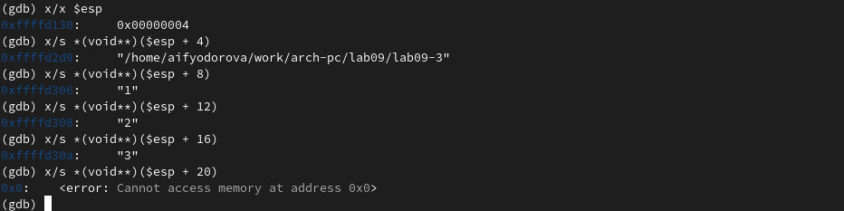
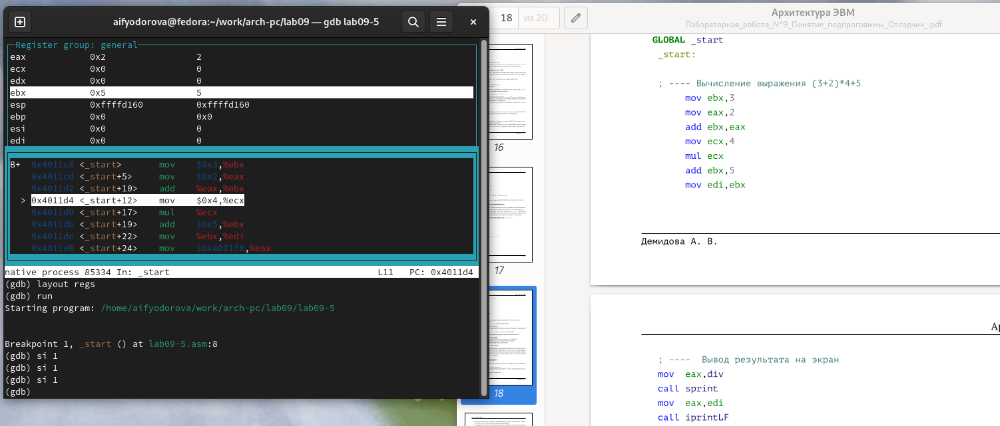

---
## Front matter
title: "Отчет по лабораторной работе №9"
subtitle: "Дисциплина: Архитектура компьютера"
author: "Федорова Анжелика Игоревна"

## Generic otions
lang: ru-RU
toc-title: "Содержание"

## Bibliography
bibliography: bib/cite.bib
csl: pandoc/csl/gost-r-7-0-5-2008-numeric.csl

## Pdf output format
toc: true # Table of contents
toc-depth: 2
lof: true # List of figures
lot: true # List of tables
fontsize: 12pt
linestretch: 1.5
papersize: a4
documentclass: scrreprt
## I18n polyglossia
polyglossia-lang:
  name: russian
  options:
	- spelling=modern
	- babelshorthands=true
polyglossia-otherlangs:
  name: english
## I18n babel
babel-lang: russian
babel-otherlangs: english
## Fonts
mainfont: PT Serif
romanfont: PT Serif
sansfont: PT Sans
monofont: PT Mono
mainfontoptions: Ligatures=TeX
romanfontoptions: Ligatures=TeX
sansfontoptions: Ligatures=TeX,Scale=MatchLowercase
monofontoptions: Scale=MatchLowercase,Scale=0.9
## Biblatex
biblatex: true
biblio-style: "gost-numeric"
biblatexoptions:
  - parentracker=true
  - backend=biber
  - hyperref=auto
  - language=auto
  - autolang=other*
  - citestyle=gost-numeric
## Pandoc-crossref LaTeX customization
figureTitle: "Рис."
tableTitle: "Таблица"
listingTitle: "Листинг"
lofTitle: "Список иллюстраций"
lotTitle: "Список таблиц"
lolTitle: "Листинги"
## Misc options
indent: true
header-includes:
  - \usepackage{indentfirst}
  - \usepackage{float} # keep figures where there are in the text
  - \floatplacement{figure}{H} # keep figures where there are in the text
---

# Цель работы

Приобретение навыков написания программ с использованием подпрограмм. Знакомство
с методами отладки при помощи GDB и его основными возможностями.

# Задание

1. Преобразуйте программу из лабораторной работы №8 (Задание №1 для самостоятель-
ной работы), реализовав вычисление значения функции f(x) как подпрограмму.
2. В листинге 9.3 приведена программа вычисления выражения (3 + 2)*4 + 5. При запуске
данная программа дает неверный результат. Проверьте это. С помощью отладчика GDB,
анализируя изменения значений регистров, определите ошибку и исправьте ее.

# Теоретическое введение

Отладка — это процесс поиска и исправления ошибок в программе. Отладчики позволяют управлять ходом выполнения программы, контролировать и изменять данные. Это помогает быстрее найти место ошибки в программе и ускорить её исправление. Наиболее популярные способы работы с отладчиком — это использование точек останова и выполнение программы по шагам.

GDB (GNU Debugger — отладчик проекта GNU) работает на многих UNIX-подобных системах и умеет производить отладку многих языков программирования. GDB предлагает обширные средства для слежения и контроля за выполнением компьютерных программ. Отладчик не содержит собственного графического пользовательского интерфейса и использует стандартный текстовый интерфейс консоли. Однако для GDB существует несколько сторонних графических надстроек, а кроме того, некоторые интегрированные среды разработки используют его в качестве базовой подсистемы отладки.

Отладчик GDB (как и любой другой отладчик) позволяет увидеть, что происходит «внутри» программы в момент её выполнения или что делает программа в момент сбоя.

Команда run (сокращённо r) — запускает отлаживаемую программу в оболочке GDB.

Команда kill (сокращённо k) прекращает отладку программы, после чего следует вопрос о прекращении процесса отладки. Если в ответ введено y (то есть «да»), отладка программы прекращается. Командой run её можно начать заново, при этом все точки останова (breakpoints), точки просмотра (watchpoints) и точки отлова (catchpoints) сохраняются.

Для выхода из отладчика используется команда quit (или сокращённо q).

Если есть файл с исходным текстом программы, а в исполняемый файл включена информация о номерах строк исходного кода, то программу можно отлаживать, работая в отладчике непосредственно с её исходным текстом. Чтобы программу можно было отлаживать на уровне строк исходного кода, она должна быть откомпилирована с ключом -g.

Установить точку останова можно командой break (кратко b). Типичный аргумент этой команды — место установки. Его можно задать как имя метки или как адрес. Чтобы не было путаницы с номерами, перед адресом ставится «звёздочка».

Информацию о всех установленных точках останова можно вывести командой info (кратко i).

Для того чтобы сделать неактивной какую-нибудь ненужную точку останова, можно воспользоваться командой disable.

Обратно точка останова активируется командой enable.

Если же точка останова в дальнейшем больше не нужна, она может быть удалена с помощью команды delete.

Для продолжения остановленной программы используется команда continue (c). Выполнение программы будет происходить до следующей точки останова. В качестве аргумента может использоваться целое число N, которое указывает отладчику проигнорировать N − 1 точку останова (выполнение остановится на N-й точке).

Команда stepi (кратко sI) позволяет выполнять программу по шагам, т.е. данная команда выполняет ровно одну инструкцию.

Подпрограмма — это, как правило, функционально законченный участок кода, который можно многократно вызывать из разных мест программы. В отличие от простых переходов из подпрограмм существует возврат на команду, следующую за вызовом. Если в программе встречается одинаковый участок кода, его можно оформить в виде подпрограммы, а во всех нужных местах поставить её вызов. При этом подпрограмма будет содержаться в коде в одном экземпляре, что позволит уменьшить размер кода всей программы.

Для вызова подпрограммы из основной программы используется инструкция call, которая заносит адрес следующей инструкции в стек и загружает в регистр eip адрес соответствующей подпрограммы, осуществляя таким образом переход. Затем начинается выполнение подпрограммы, которая, в свою очередь, также может содержать подпрограммы. Подпрограмма завершается инструкцией ret, которая извлекает из стека адрес, занесённый туда соответствующей инструкцией call, и заносит его в eip. После этого выполнение основной программы возобновится с инструкции, следующей за инструкцией call.


# Выполнение лабораторной работы

Создаю каталог для выполнения лабораторной работы № 9, перехожу в него и создаю файл lab09-1.asm.(рис. fig:001).

{#fig:001 width=70%}

Копирую файл in_out.asm в каталог ~/work/arch-pc/lab09 для работы.(рис. fig:002)

{#fig:002 width=70%}

Ввожу в файл lab09-1.asm текст программы с использованием подпрограммы из листинга 9.1(рис. fig:003)

{#fig:003 width=70%}

Создаю исполняемый файл и проверяю его работу. (рис. fig:004)

{#fig:004 width=70%}

Программа выводит решение уравнения с подстановкой введенного аргумета в переменную х
Теперь я изменяю текст программы, добавив подпрограмму _subcalcul в подпрограмму _calcul для вычисления выражения f(g(x)), где x вводится с клавиатуры, f(x) = 2x + 7, g(x) = 3x − 1. (рис. fig:005)

{#fig:005 width=70%}

Создаю исполняемый файл и проверяю его работу. (рис. fig:006)

{#fig:006 width=70%}

Программа успешно выводит верный ответ функции f(x) = 2(3x − 1) + 7

Создаю файл lab09-2.asm с текстом программы из Листинга 9.2.(рис. fig:007)

{#fig:007 width=70%}

Получаю исполняемый файл для работы с GDB с ключом ‘-g’.(рис. fig:008)

{#fig:008 width=70%}

Загружаю исполняемый файл в отладчик gdb.(рис. fig:009)

{#fig:009 width=70%}

Проверяю работу программы, запустив ее в оболочке GDB с помощью команды run.(рис. fig:010)

{#fig:010 width=70%}

Для более подробного анализа программы устанавливаю брейкпоинт на метку _start и запускаю её. (рис. fig:011)

{#fig:011 width=70%}

Просматриваю дисассимилированный код программы с помощью команды disassemble, начиная с метки _start, и переключаюсь на отображение команд с синтаксисом Intel, введя команду set disassembly-flavor intel  (рис. fig:012)

{#fig:012 width=70%}

В режиме ATT имена регистров начинаются с символа %, а имена операндов с $, в то время как в Intel используется привычный нам синтаксис.

Включаю режим псевдографики для более удобного анализа программы с помощью команд layout asm и layout regs.(рис. fig:013)

{#fig:013 width=70%}

Проверяю, что точка останова по имени метки _start установлена с помощью команды info breakpoints и устанавливаю еще одну точку останова по адресу инструкции mov ebx,0x0. 
Просматриваю информацию о всех установленных точках останова.(рис. fig:014)

{#fig:014 width=70%}

Выполняю 5 инструкций с помощью команды stepi и слежу за изменением значений регистров.(рис. fig:015)

{#fig:015 width=70%}

Значения регистров изменяются в соответствии с кодом программы. В зависимости от того на какую строку кода я попаду с помощью команды stepi(сколько шагов поставлю от точки остановки) от того будет зависеть значение регистра.
С помощью команды set изменяю первый символ переменной msg1 и заменяю первый символ в переменной msg2.(рис. fig:016)

{#fig:016 width=70%}

Вывожу в шестнадцатеричном формате, в двоичном формате и в символьном виде соответственно значение регистра edx с помощью команды print p/F $val. (рис. fig:017)

{#fig:017 width=70%}

С помощью команды set изменяю значение регистра ebx в соответствии с заданием. (рис. fig:018)

{#fig:018 width=70%}

Разница вывода команд p/s $ebx отличается тем, что в первом случае мы переводим символ в его строковый вид, а во втором случае число в строковом виде не изменяется.
Завершаю выполнение программы с помощью команды continue и выхожу из GDB с помощью команды quit  (рис. fig:019)

{#fig:019 width=70%}

Копирую файл lab8-2.asm с программой из листинга 8.2 в файл с именем lab09-3.asm и создаю исполняемый файл. (рис. fig:020)

{#fig:020 width=70%}

Загружаю исполняемый файл в отладчик gdb, указывая необходимые аргументы с использованием ключа --args (рис. fig:021)

{#fig:021 width=70%}

Устанавливаю точку останова перед первой инструкцией в программе и запускаю ее.(рис. fig:022)

{#fig:021 width=70%}

Посматриваю вершину стека и позиции стека по их адресам. (рис. fig:023)

{#fig:023 width=70%}

Шаг изменения адреса равен 4, т.к количество аргументов командной строки равно 4.

# Самостоятельная работа

1. Создаю файл  lab09-4.asm для самостоятельной работы, скопировав в него содержание файла lab09-4.asm из предыдущей лабораторной работы. (рис. fig:024)

{#fig:024 width=70%}

Преобразовываю программу из лабораторной работы №8 (Задание №1 для самостоятельной работы), реализовав вычисление значения функции f(x) как подпрограмму.(рис. fig:025)

{#fig:025 width=70%}

Запускаю код и проверяю, что она работает корректно. (рис. fig:026)

{#fig:026 width=70%}

Код программы: 

```NASM

%include 'in_out.asm'
SECTION .data
msg db "Результат: ",0
SECTION .text
global _start
_start:
pop ecx ; Извлекаем из стека в ecx количество
; аргументов (первое значение в стеке)
pop edx ; Извлекаем из стека в edx имя программы
; (второе значение в стеке)
sub ecx,1 ; Уменьшаем ecx на 1 (количество
; аргументов без названия программы)
mov esi, 0 ; Используем esi для хранения
; промежуточных сумм
next:
cmp ecx,0h ; проверяем, есть ли еще аргументы
jz _end ; если аргументов нет выходим из цикла
        ; (переход на метку _end)
pop eax ; иначе извлекаем следующий аргумент из стекa
call atoi ; преобразуем символ в число 
call _calculus ;вызываю подпрограмму _сalculus
loop next ; переход к обработке следующего аргумента


_end:
mov eax , msg ; вывод сообщения "Результат: "
call sprint
mov eax, esi ; записываем сумму в регистр eax
call iprintLF ; печать результата
call quit ; завершение программы

_calculus: ; исполнение подпрограммы, которая работает с аргументами

mov ebx,15
mul ebx
sub eax,9
add esi, eax

ret ; возращение в основную программу
```


2. Создаю файл lab09-5.asm  для второго самостоятельного задания (рис. fig:027)

{#fig:027 width=70%}

Ввожу в файл lab09-5.asm текст программы из листинга 9.3. (рис. fig:028) 

{#fig:028 width=70%}

При корректной работе программы должно выводится "25". Создаю исполняемый файл с ключом -g и запускаю его. (рис. fig:029) 

{#fig:029 width=70%}

Запускаю данную программу с помощью команды run и вижу результат работы кода в файле (рис. fig:030) 

{#fig:030 width=70%}

Ставлю точку остановки на строку с инструкцией _start (рис. fig:031) 

{#fig:031 width=70%}

Устанавливаю также режим псевдографики с помощью команд layout asm и layout regs (рис. fig:032) 

{#fig:032 width=70%}

Далее я запускаю программу и с помощью команды stepi внимательно изучаю изменения в регистрах во время этапов их суммы (рис. fig:033) и умножения на ecx (рис. fig:034).

{#fig:033 width=70%}

{#fig:034 width=70%}

Я вижу, что регистр ebx принял значение 5 после суммы с eаx, однако после строки с умножением на eсx именно значение, записанное в регистре eаx увеличилось в 4 раза. 
Поэтому после увеличения ebx на 5 конечный ответ получается 10. 
Захожу в файл lab09-5.asm и исправляю код программы, меняя местами в строке сложения ebx и eаx эти регистры местами. (рис. fig:035)

{#fig:035 width=70%}

Теперь создаю снова исполняемый файл и запускаю его. (рис. fig:036)

{#fig:036 width=70%}

Вижу, что теперь программа выводит правильный ответ.


Код программы: 


```NASM

%include 'in_out.asm'
SECTION .data
div: DB 'Результат: ',0
SECTION .text
GLOBAL _start
 _start:
; ---- Вычисление выражения (3+2)*4+5
 mov ebx,3
 mov eax,2
 add eax,ebx
 mov ecx,4
 mul ecx
 add eax,5
 mov edi,eax
 
 ; ----Вывод результата на экран
 mov eax,div
 call sprint
 mov eax,edi
 call iprintLF
 call quit


```

# Выводы

Я приобрела навыки написания программ с использованием подпрограмм и познакомилась
с методами отладки при помощи GDB и его основными возможностями.

# Список литературы
 [Лабораторная работа №9. Понятие подпрограммы.Отладчик GDB.](https://esystem.rudn.ru/pluginfile.php/2089096/mod_resource/content/0/%D0%9B%D0%B0%D0%B1%D0%BE%D1%80%D0%B0%D1%82%D0%BE%D1%80%D0%BD%D0%B0%D1%8F%20%D1%80%D0%B0%D0%B1%D0%BE%D1%82%D0%B0%20%E2%84%969.%20%D0%9F%D0%BE%D0%BD%D1%8F%D1%82%D0%B8%D0%B5%20%D0%BF%D0%BE%D0%B4%D0%BF%D1%80%D0%BE%D0%B3%D1%80%D0%B0%D0%BC%D0%BC%D1%8B.%20%D0%9E%D1%82%D0%BB%D0%B0%D0%B4%D1%87%D0%B8%D0%BA%20..pdf)

