---
## Front matter
title: "Отчёт по лабораторной работе №10"
subtitle: "Дисциплина: архитектура компьютера"
author: "Федорова Анжелика Игоревна"

## Generic otions
lang: ru-RU
toc-title: "Содержание"

## Bibliography
bibliography: bib/cite.bib
csl: pandoc/csl/gost-r-7-0-5-2008-numeric.csl

## Pdf output format
toc: true # Table of contents
toc-depth: 2
lof: true # List of figures
lot: true # List of tables
fontsize: 12pt
linestretch: 1.5
papersize: a4
documentclass: scrreprt
## I18n polyglossia
polyglossia-lang:
  name: russian
  options:
	- spelling=modern
	- babelshorthands=true
polyglossia-otherlangs:
  name: english
## I18n babel
babel-lang: russian
babel-otherlangs: english
## Fonts
mainfont: PT Serif
romanfont: PT Serif
sansfont: PT Sans
monofont: PT Mono
mainfontoptions: Ligatures=TeX
romanfontoptions: Ligatures=TeX
sansfontoptions: Ligatures=TeX,Scale=MatchLowercase
monofontoptions: Scale=MatchLowercase,Scale=0.9
## Biblatex
biblatex: true
biblio-style: "gost-numeric"
biblatexoptions:
  - parentracker=true
  - backend=biber
  - hyperref=auto
  - language=auto
  - autolang=other*
  - citestyle=gost-numeric
## Pandoc-crossref LaTeX customization
figureTitle: "Рис."
tableTitle: "Таблица"
listingTitle: "Листинг"
lofTitle: "Список иллюстраций"
lotTitle: "Список таблиц"
lolTitle: "Листинги"
## Misc options
indent: true
header-includes:
  - \usepackage{indentfirst}
  - \usepackage{float} # keep figures where there are in the text
  - \floatplacement{figure}{H} # keep figures where there are in the text
---

# Цель работы

Приобретение навыков написания программ для работы с файлами.

# Задание

Напишите программу работающую по следующему алгоритму:
• Вывод приглашения “Как Вас зовут?”
• ввести с клавиатуры свои фамилию и имя
• создать файл с именем name.txt
• записать в файл сообщение “Меня зовут”
• дописать в файл строку введенную с клавиатуры
• закрыть файл

# Теоретическое введение

С GNU/Linux является многопользовательской операционной системой. И для обеспече-
ния защиты данных одного пользователя от действий других пользователей существуют
специальные механизмы разграничения доступа к файлам. Кроме ограничения доступа, дан-
ный механизм позволяет разрешить другим пользователям доступ данным для совместной
работы.Права доступа определяют набор действий (чтение, запись, выполнение), разрешённых
для выполнения пользователям системы над файлами. Для каждого файла пользователь
может входить в одну из трех групп: владелец, член группы владельца, все остальные. Для
каждой из этих групп может быть установлен свой набор прав доступа.Набор прав доступа задается тройками битов и состоит из прав на чтение, запись и ис-
полнение файла. В символьном представлении он имеет вид строк rwx, где вместо любого
символа может стоять дефис. Всего возможно 8 комбинаций, приведенных в таблице 10.1.
Буква означает наличие права (установлен в единицу второй бит триады r — чтение, первый
бит w — запись, нулевой бит х — исполнение), а дефис означает отсутствие права (нулевое
значение соответствующего бита). Также права доступа могут быть представлены как вось-
меричное число. Так, права доступа rw- (чтение и запись, без исполнения) понимаются как
три двоичные цифры 110 или как восьмеричная цифра 6.


Для создания и открытия файла служит системный вызов sys_creat, который использует
следующие аргументы: права доступа к файлу в регистре ECX, имя файла в EBX и номер
системного вызова sys_creat (8) в EAX.


Для записи в файл служит системный вызов sys_write, который использует следующие
аргументы: количество байтов для записи в регистре EDX, строку содержимого для записи
ECX, файловый дескриптор в EBX и номер системного вызова sys_write (4) в EAX.
Системный вызов возвращает фактическое количество записанных байтов в регистр EAX.
В случае ошибки, код ошибки также будет находиться в регистре EAX.
Прежде чем записывать в файл, его необходимо создать или открыть, что позволит полу-
чить дескриптор файла


Для чтения данных из файла служит системный вызов sys_read, который использует
следующие аргументы: количество байтов для чтения в регистре EDX, адрес в памяти для
записи прочитанных данных в ECX, файловый дескриптор в EBX и номер системного вызова
sys_read (3) в EAX. Как и для записи, прежде чем читать из файла, его необходимо открыть,
что позволит получить дескриптор файла.

Для правильного закрытия файла служит системный вызов sys_close, который использует
один аргумент – дескриптор файла в регистре EBX. После вызова ядра происходит удаление
дескриптора файла, а в случае ошибки, системный вызов возвращает код ошибки в регистр
EAX.


Для изменения содержимого файла служит системный вызов sys_lseek, который исполь-
зует следующие аргументы: исходная позиция для смещения EDX, значение смещения в
байтах в ECX, файловый дескриптор в EBX и номер системного вызова sys_lseek (19) в EAX.
В случае ошибки, системный вызов возвращает код ошибки в регистр EAX.


Удаление файла осуществляется системным вызовом sys_unlink, который использует
один аргумент – имя файла в регистре EBX.


# Выполнение лабораторной работы

 Создадим каталог для программ лабораторной работы и создадим в нем необходимые файлы (рис. fig:001).

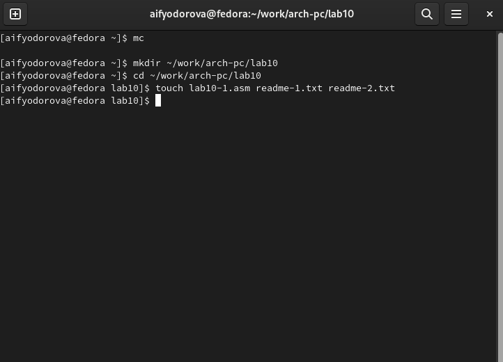{#fig:001 width=70%}

Скопирую файл in-out.asm в нужный мне каталог. (рис. fig:002)

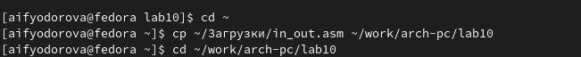{#fig:002 width=70%}

Введём в файл lab10-1.asm текст программы из листинга (рис. fig:003).

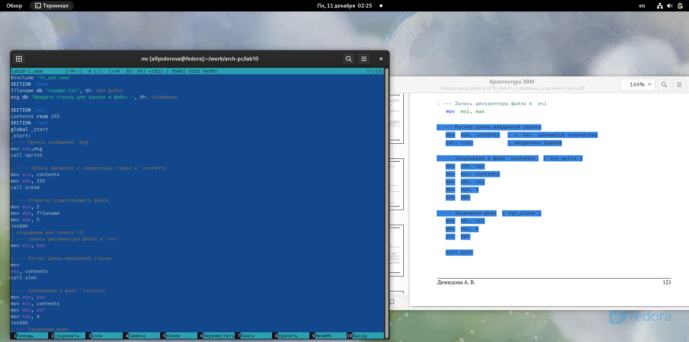{#fig:003 width=70%}

Создадим исполняемый файл и проверим его работу (рис. fig:004).

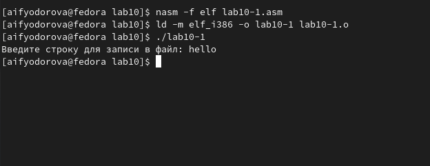{#fig:004 width=70%}

Теперь проверю содержимое файла readme-1.txt (рис.fig:005).

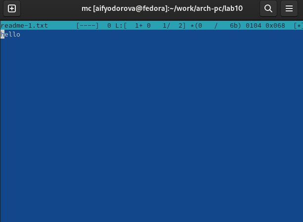{#fig:005 width=70%}

Вижу, что программа сработала успешно.

С помощью команды chmod изменим права доступа к исполняемому файлу lab10-1, запретив его выполнение (рис.fig:006).

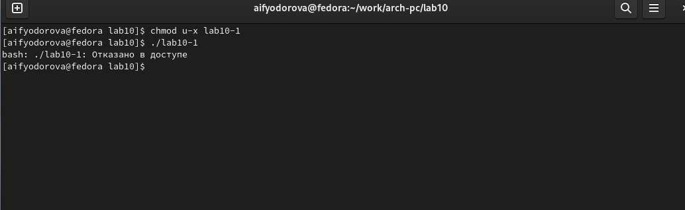{#fig:006 width=70%}

Теперь доступ к файлу запрещён.

Изменим права доступа к файлу lab10-1.asm, добавив права на исполнение (рис. fig:007).

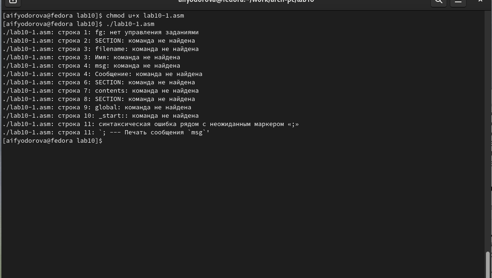{#fig:007 width=70%}

Файл нельзя выполнить, т.к. он не содержит указаний для терминала, а просто является текстом программы.

Проверю какие права имеются у пользователей файла  readme-1.txt с помощью команды ls с ключом -l(рис. fig:008).

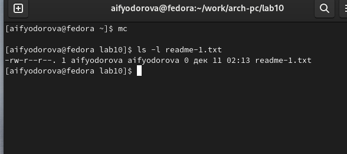{#fig:008 width=70%}

Предоставим права доступа к этому файлу в соответствии с вариантом 12 (рис.fig:009).

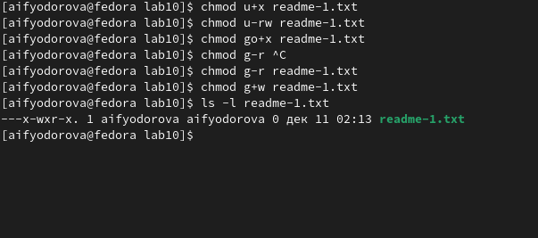{#fig:009 width=70%}

Проделаю то же самое, но с помощью двоичного кода с файлом readme-2.txt (рис.fig:010).

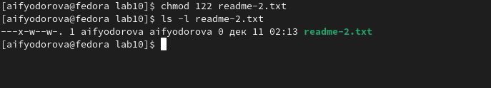{#fig:010 width=70%}

# Самостоятельная работа

Скопирую содержимое файла lab10-1.asm в файла name.asm (рис.fig:011).

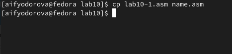{#fig:011 width=70%}

Редактирую код данного файла в соответствии с целью задания (рис.fig:012).

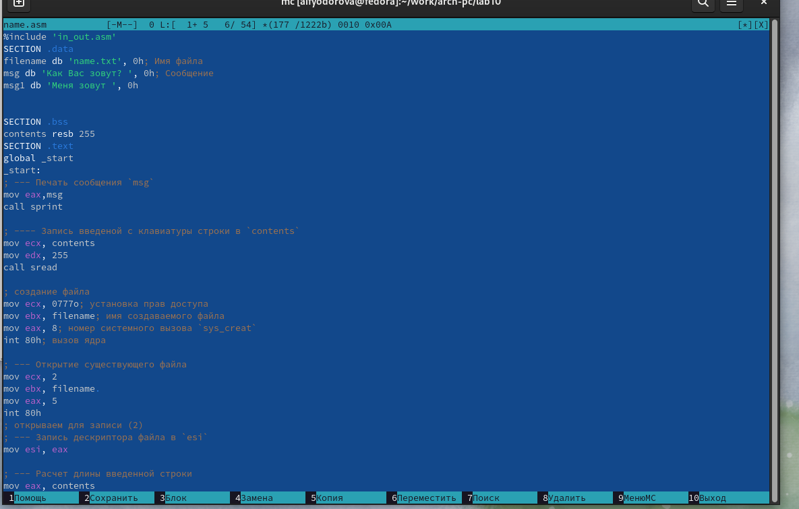{#fig:012 width=70%}

Создаю исполняемый файл и запускаю его. (рис.fig:013)

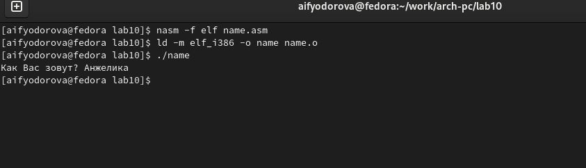{#fig:013 width=70%}

Теперь проверяю содержимое каталога с помощью ls (должен быть создан файл name.txt) и проверяю его содержимое с помощью команды сat(рис.fig:014)

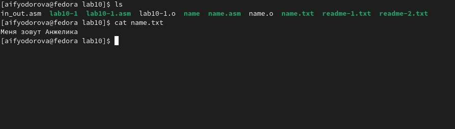{#fig:014 width=70%}

Программа работает в соответствии с требованиями задания.


Код программы:

```NASM

%include 'in_out.asm'
SECTION .data
filename db 'name.txt', 0h; Имя файла
msg db 'Как Вас зовут? ', 0h; Сообщение
msg1 db 'Меня зовут ', 0h


SECTION .bss
contents resb 255
SECTION .text
global _start
_start:
; --- Печать сообщения msg
mov eax,msg
call sprint

; ---- Запись введеной с клавиатуры строки в contents
mov ecx, contents
mov edx, 255
call sread

; создание файла
mov ecx, 0777o; установка прав доступа
mov ebx, filename; имя создаваемого файла
mov eax, 8; номер системного вызова sys_creat
int 80h; вызов ядра

; --- Открытие существующего файла
mov ecx, 2
mov ebx, filename 
mov eax, 5
int 80h
; открываем для записи (2)
; --- Запись дескриптора файла в esi
mov esi, eax

mov eax, msg1; в eax запишется количество
call slen ; введенных байтов

; --- Записываем в файл contents (sys_write)
mov edx, eax
mov ecx, msg1
mov ebx, esi
mov eax, 4
int 80h

; --- Расчет длины введенной строки
mov eax, contents
call slen

; --- Записываем в файл contents

mov edx, eax
mov ecx, contents
mov ebx, esi
mov eax, 4
int 80h
; --- Закрываем файл
mov ebx, esi
mov eax, 6
int 80h

call quit

```

# Выводы

Я приобрела навыки написания программ для работы с файлами.

# Список литературы

[Лабораторная работа №10. Работа с файлами средствами Nasm](https://esystem.rudn.ru/pluginfile.php/2089097/mod_resource/content/0/%D0%9B%D0%B0%D0%B1%D0%BE%D1%80%D0%B0%D1%82%D0%BE%D1%80%D0%BD%D0%B0%D1%8F%20%D1%80%D0%B0%D0%B1%D0%BE%D1%82%D0%B0%20%E2%84%9610.%20%D0%A0%D0%B0%D0%B1%D0%BE%D1%82%D0%B0%20%D1%81%20%D1%84%D0%B0%D0%B9%D0%BB%D0%B0%D0%BC%D0%B8%20%D1%81%D1%80%D0%B5%D0%B4%D1%81%D1%82%D0%B2%D0%B0%D0%BC%D0%B8%20Nasm.pdf)
